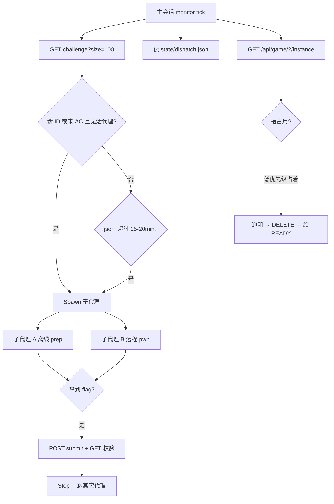

NepCTF 2026 用 Claude Code 当「总控 + 工人」：主会话只盯榜单和槽位，真正解题全部丢给子代理。本文整理压缩前实际跑通的一套策略——自动交 flag、多子代理并行、内存硬限制、以及**只有一个远程实例槽时怎么抢占**。

最终成绩：rank **20** / 1011 队，score **6916**，**27** 题 AC（队名 catcatyu）。这不是「模型多聪明」的单点展示，而是**调度系统**能不能在 12G 内存、单实例槽、JWT 会过期的约束下持续产 flag。

## 可复现打包（解压后直接 `claude`）

策略已拆成独立仓库 + zip，带 **mock 平台离线 demo**（不需要真实比赛账号也能看到「#71 低 solves REMOTE_ONLY 被 #64 READY 抢槽」）。

| 资源 | 链接 |
|------|------|
| **GitHub 仓库** | [fjh1997/ctf-agent-dispatch](https://github.com/fjh1997/ctf-agent-dispatch) |
| **zip 下载（推荐 v0.2.0）** | [ctf-agent-dispatch-0.2.0.zip](https://github.com/fjh1997/ctf-agent-dispatch/releases/download/v0.2.0/ctf-agent-dispatch-0.2.0.zip) |
| Release 页 | [v0.2.0](https://github.com/fjh1997/ctf-agent-dispatch/releases/tag/v0.2.0)（含根 `CLAUDE.md` + `.claude/agents/`） |

```bash
curl -L -o ctf-agent-dispatch-0.2.0.zip \
  https://github.com/fjh1997/ctf-agent-dispatch/releases/download/v0.2.0/ctf-agent-dispatch-0.2.0.zip
unzip ctf-agent-dispatch-0.2.0.zip && cd ctf-agent-dispatch-0.2.0
python3 -m venv .venv && . .venv/bin/activate
pip install -r requirements.txt
python scripts/selftest.py
# 期望输出: SELFTEST_OK / preempt path: REMOTE_ONLY#71 -> READY#64
```

仓库内还包含：

- 根目录 **`CLAUDE.md`**（Claude Code 打开项目自动加载）
- **`AGENTS.md`** + **`.claude/agents/ctf-worker.md` / `ctf-monitor.md`**（可 Spawn 子代理）
- `agents/CLAUDE.md`、`bin/ctf-run-scoped`、`examples/nepctf2026.yaml`

> 说明：不是「不需要 agents 配置」。v0.1.0 只放了 `agents/CLAUDE.md` 命名偏内部；**v0.2.0 起以根 `CLAUDE.md` + `.claude/agents/` 为准**。

<!--more-->

## 总览：主会话不解题

核心分工：

| 角色 | 干什么 | 不干什么 |
|------|--------|----------|
| **主会话（monitor）** | 拉榜、差分新题、看 dispatch 表、开/杀子代理、抢实例槽、刷新 JWT | 不在主上下文里硬刚 RE / angr |
| **子代理（worker）** | 单题离线 prep / 写 exp / 打远程 / 交 flag | 不随便 DELETE 别人的实例；不无限占槽 |



工作根目录必须落在持久盘：

```text
/home/catcatyu/nepctf/          # 唯一 work_root，禁止 /tmp/nepctf
├── TOKEN                       # JWT，CDP 刷新
├── state/
│   ├── dispatch.json           # 题 ID → agent 状态
│   ├── board_latest.json
│   └── monitor_state.json
└── work/<id>/
    ├── flag.txt
    ├── exp/
    ├── detail.json / files.json
    └── repro/
```

`/tmp` 重启就没了——早期丢过一整棵 work19，血泪。

## 平台 API 最小集

`game_id=2`，鉴权：`Authorization: Bearer $TOKEN`。

| 用途 | 方法 | 路径 |
|------|------|------|
| 题列表 | GET | `/api/game/2/challenge?size=100` |
| 题详情 | GET | `/api/game/2/challenge/{id}` |
| 附件 | GET | `/api/game/2/challenge/{id}/file?folder=static&file={name}` |
| 开实例 | POST | `/api/game/2/challenge/{id}/instance` |
| 列实例 | GET | `/api/game/2/instance` |
| 关实例 | DELETE | `/api/game/2/challenge/{id}/instance` |
| 交 flag | POST | `/api/game/2/challenge/{id}/submit` |
| 校验 | GET | `/api/game/2/challenge/{id}/submit` → `solved:true` |

注意：

1. 附件**必须** query 形式 `?folder=static&file=...`，路径式 URL 会落到 SPA HTML。
2. DELETE 是 `.../challenge/{id}/instance`，不是 `.../instance` 光秃秃一条（会 405）。
3. 提交字段主办方前端用过 `content`；部分脚本 `flag` / `content` 双写更稳。
4. 远程 flag **按实例动态**，和比赛时 `flag.txt` 字符串不同是正常的。

### 自动交 flag（子代理侧）

子代理拿到 `NepCTF{...}` / `flag{...}` 后的标准收尾：

```bash
export NO_PROXY='*' no_proxy='*'
TOKEN=$(cat /home/catcatyu/nepctf/TOKEN)
FLAG='NepCTF{...}'   # 或 flag{...}
ID=47

echo "$FLAG" > /home/catcatyu/nepctf/work/$ID/flag.txt

# 提交（双字段兼容）
curl --noproxy '*' -sS -X POST \
  -H "Authorization: Bearer $TOKEN" \
  -H 'Content-Type: application/json' \
  -d "{\"content\":\"$FLAG\",\"flag\":\"$FLAG\"}" \
  "https://www.nepctf.com/api/game/2/challenge/$ID/submit"

# 校验
curl --noproxy '*' -sS \
  -H "Authorization: Bearer $TOKEN" \
  "https://www.nepctf.com/api/game/2/challenge/$ID/submit"
# 期望: {"solved":true,"solves":N}
```

主会话看到 `solved:true` 或子代理报告 AC 后：**立刻停掉该题仍在跑的本地代理**，避免空转烧内存。

## 多子代理：怎么开、开多少

### 主会话原则

- **主会话 = 调度器**，不把 27 题 RE 全塞进自己的 context。
- 一题至少一个 worker；离线 prep 与远程 exploit 可拆成先后两个 agent。
- `state/dispatch.json` 记：`id → agent_id / status / last_beat / READY 等级`。
- 同题禁止双活（除非明确 pipeline：A 写 exp，B 等 A 的 READY 再打远程）。

### 派发触发（每个 monitor tick）

1. `board_ids - dispatch_ids` → **新题立刻离线 prep**。
2. 未 AC 且 `status` 像在干活，但 agent jsonl **超过 15–20 分钟无更新** → **respawn**（用户明确 hold 的除外）。
3. 题面 / 附件名相对 `work/{id}/detail.json` 有真变化 → 存 `*.prev.json`，`content_changed=true`，**带着新提示重派**。
4. 子代理 `completed` 但硬验收没过（例如 #42 没弹出 calc）→ **只带着 residual gap 再 spawn**，不许当 done 躺平。

### 并发上限

| 类型 | 上限 | 原因 |
|------|------|------|
| 重求解（angr / unicorn / 遗传 / 双模拟 / V8 fuzz） | **≤2** | 12G 主机，再多必 swap 螺旋 |
| 轻离线（OSINT / web 读代码 / 小脚本） | 可多一些 | 内存尖刺小 |
| ProcessPool / 多进程 | **workers≤2** | 禁止 `os.cpu_count()` |
| 远程实例 | **全队 1 槽** | 平台限制，见下节 |

### 子代理 prompt 里必写的约束

每个 worker 系统提示里固化（不是可选）：

- work_root = `/home/catcatyu/nepctf`，TOKEN 路径固定。
- **MemoryMax 包装**（下一节）。
- 附件下载 URL 形态。
- 交 flag 的 POST + GET 校验。
- **不要** DELETE 非自己优先级规则允许的实例；先通知占用方。
- REALWORLD 展示题（#42 等）：交付物是可跑 PoC，不是「分析完了」。
- 禁止付费下附件；禁止 Ghost 写真盘。

## 内存硬限制：所有重活进 cgroup

背景：主机大约 **12G RAM + 16G swap**。真·OOM 元凶往往是胖 **python3**（单进程 RSS+swap 到 6G+），不是浏览器。

### 默认包装（每个 solver / RE）

```bash
systemd-run --user --scope \
  -p MemoryMax=3G \
  -p MemoryHigh=2.5G \
  -p TasksMax=64 \
  --quiet --collect -- \
  python3 script.py …
```

`systemd-run` 不可用时：

```bash
ulimit -v 3500000   # ~3.5G 虚拟地址空间
ulimit -u 64
python3 script.py
```

轻量 curl / 提交也尽量给长 python 加 `ulimit -v 2000000`。

### 额外军规

- 禁止无界多进程遗传、整二进制 angr 一把梭、`open().read()` 读 multi-GB dump。
- 大文件用 mmap / 流式；临时 dump 用完就删；不要在内存里同时摊开多份 PE/APK。
- 主会话若发现某 agent 的 python **无 scope 却 RSS ≳1.5G** → kill，套上 MemoryMax 重跑。
- Windows PE（#36 ColorfulArray 等）**上宿主机 Windows 调**，不要指望 WSL Wine 完整。

## 实例槽：唯一的全局锁

平台侧基本是 **整队同时只能挂一个 challenge instance**。离线题不占槽；远程 pwn/web/AI 容器题抢这把锁。

### 优先级（#71 抢 #64 之后订正）

从高到低：

1. **True READY / LOCAL_OK one-shot**  
   离线链路已 E2E 跑通，只差远程确认。同级按 **solves 高优先**（分越低越急也可以，我们实现里用 solves 作衰减题的价值代理）。
2. **有附件 + 远程路径清晰**  
   exp 写好了，只差 host。
3. **REMOTE_ONLY**（无附件，必须 live 摸）  
   **仅当没有更高档 READY 在排队时**才能占槽。  
   同级同样 higher solves first。  
   **禁止** 0～2 solves 的 REMOTE_ONLY 抢走 READY 且 solves 更高的题（#71 抢 #64 就是反例）。
4. **水货 / 过早 READY** → 立刻让出，修到真 READY 再排队。
5. 占槽方 **15～30 分钟**只有本地空转、远程零进展 → 按上表轮转。
6. 纯离线题 **永远不挡槽**。

### 抢占动作

```text
1. 通知占用中的子代理：「槽要被更高优先级回收」
2. DELETE /api/game/2/challenge/{old_id}/instance
3. POST  /api/game/2/challenge/{new_id}/instance
4. 把 address 塞给新 worker
```

规则允许时主会话可 **不逐次人肉确认 DELETE**（赛中节奏），但 **必须先 notify** 占用 agent，避免它还在写半截 exp 突然 断连却以为自己还占着。

### 槽与题型矩阵（直觉）

```text
离线 crypto/misc ────────────── 不占槽，尽管跑（受重求解 ≤2 限制）
有附件 + exp 已本地通 ──────── READY，最高优先抢槽
无附件 REMOTE_ONLY ─────────── 低 solves 时排后面
REALWORLD 展示题 ───────────── 可离线做 PoC；平台未必要 submit
```

## JWT 与登录：CDP 刷新

WSL 里直接打 `nepctf.com` 有时要代理；平台 API 建议 `NO_PROXY=*` 直连。  
JWT 失效表现：`please login first`（401）。`please take part in first`（403）则是进队/会话问题。

刷新路径（宿主机 Edge `remote-debugging-port=9222`）：

1. Windows 上 Node + `ws` 连 `http://127.0.0.1:9222`
2. 找已登录的 nepctf 标签，`Runtime.evaluate` 读 `localStorage.account.token`
3. 写回 `/home/catcatyu/nepctf/TOKEN`

WSL 往往 **打不进** 宿主机 `127.0.0.1:9222`，所以刷新脚本跑在 **PowerShell / 宿主 Node**，不要假设 WSL 本机 CDP 一定通。

## 题面变更监控

主办会上下架、改描述、塞补题提示。每个 tick 对未 AC 题：

1. `GET /challenge/{id}`
2. 规范化 `content` + 附件 **文件名** 和 `work/{id}/detail.json` / `files.json` 比
3. 真变化 → 备份 prev，标记 `content_changed`，**带着新 hint 重派**

忽略纯 JSON key 顺序抖动。  
**不付费**下附件（付费盘 / CSDN VIP / 付费 ISO 一律跳过）。

## 外网与代理

- 子代理拉 GitHub / Google：可走 `http://192.168.1.5:10808`
- 打比赛实例、提交 flag：优先 `NO_PROXY='*'` 直连，避免代理把内网式实例域名带歪
- OSINT 禁止开一堆空白 CDP 标签刷屏

## 安全红线（写进 agent 记忆）

- **禁止** Ghost / 磁盘镜像 **restore** 到真实物理盘或盘符。
- 取证只在 `work/` 下的 **文件副本** 上做。
- Windows 真机调 PE；Linux ELF 留在 WSL。

## 一场下来最有用的教训

1. **调度 > 单题智商**：槽让低 solves REMOTE_ONLY 占着时，READY 题在干等 = 白丢分。
2. **MemoryMax 不是可选优化**：没有 cgroup 时一个 angr 就能把整台机器拖进 swap 死亡。
3. **主会话别自己做题**：context 会被 27 份 RE 撑爆；monitor 只做差分和派发。
4. **AC 立刻杀残党**：平台已 solved 的题还留着 fuzz 进程，是纯噪音。
5. **验收标准写进 prompt**：#42 必须「弹出 calc」而不是「写完分析」；否则 agent 会提前 final。
6. **动态 flag**：复现/WP 不要要求和 `flag.txt` 字符串全等。
7. **错误历史要隔离**：#23 的 force-ramp、#24 的纯 spoof、#53 的 root:123456，都是失败支路，dispatch 文档里要标成 forbidden path。

## 最小可抄清单

若只抄一页纸：

```text
work_root = ~/nepctf（非 /tmp）
主会话 = 榜单差分 + dispatch + 槽调度 + JWT
子代理 = 一题一（或 prep→remote 两段）
重活 = systemd-run MemoryMax=3G，重求解 ≤2
槽优先级 = READY/LOCAL_OK > 有exp附件 > REMOTE_ONLY(高solves)
抢槽 = notify → DELETE challenge/{id}/instance → POST 新题
交 flag = POST submit 后 GET 看 solved:true，然后 stop 同题 agent
题面变了 = 重派；付费附件 = 不做；Ghost 写真盘 = 禁止
```

## 相关

- **可复现项目**：[ctf-agent-dispatch](https://github.com/fjh1997/ctf-agent-dispatch) · [zip v0.1.0](https://github.com/fjh1997/ctf-agent-dispatch/releases/download/v0.1.0/ctf-agent-dispatch-0.1.0.zip)
- 队内 WP（手写风 + 完整代码）：赛后提交的 27 题本，路径在本机 `nepctf/WriteUp_*.md` / `20-catcatyu-549308442.pdf`
- 平台：`https://www.nepctf.com`，`game_id=2`

—— 调度比模型版本号更决定能吃下几道远程题。
