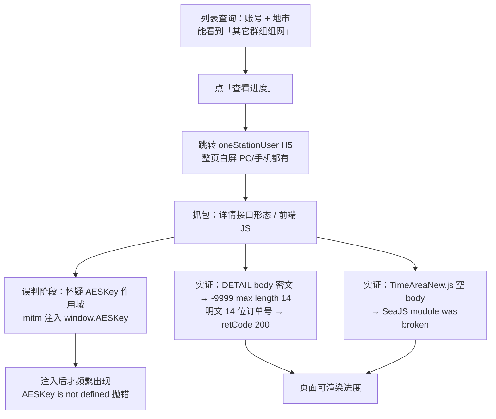
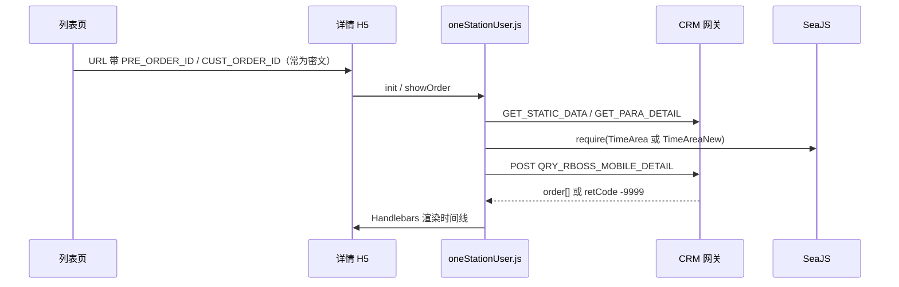
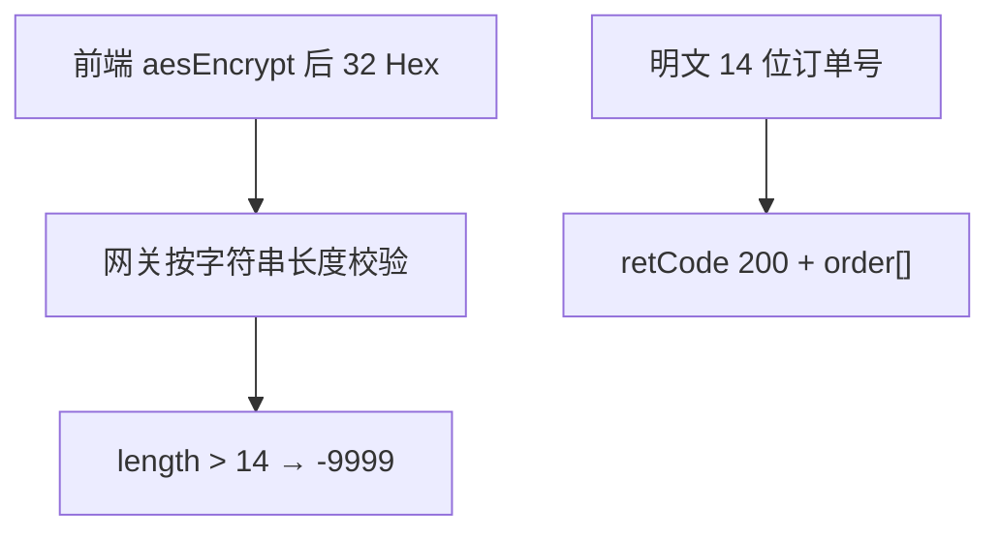
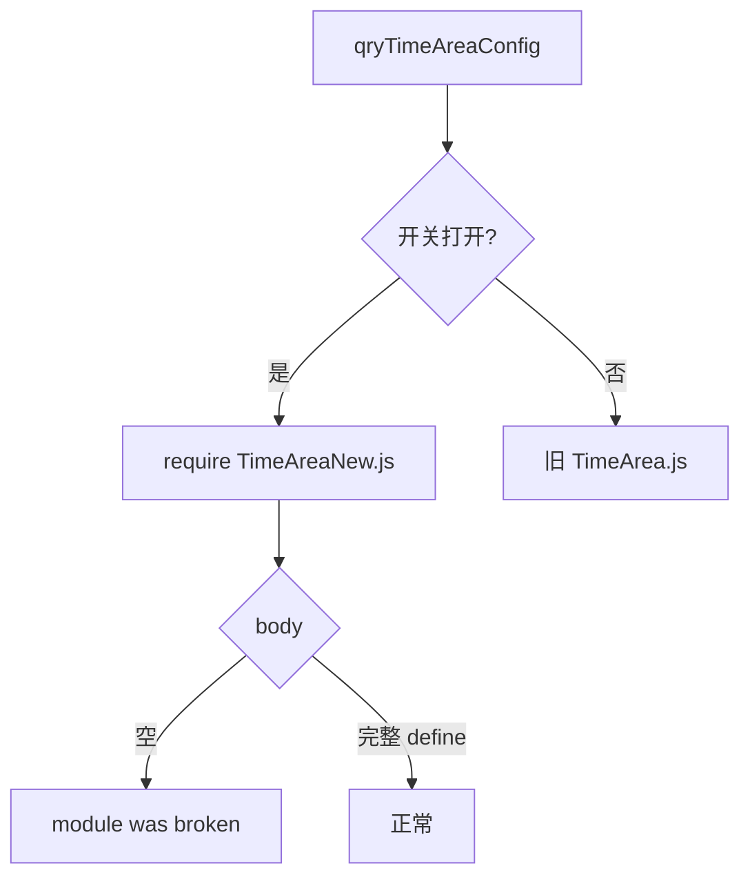
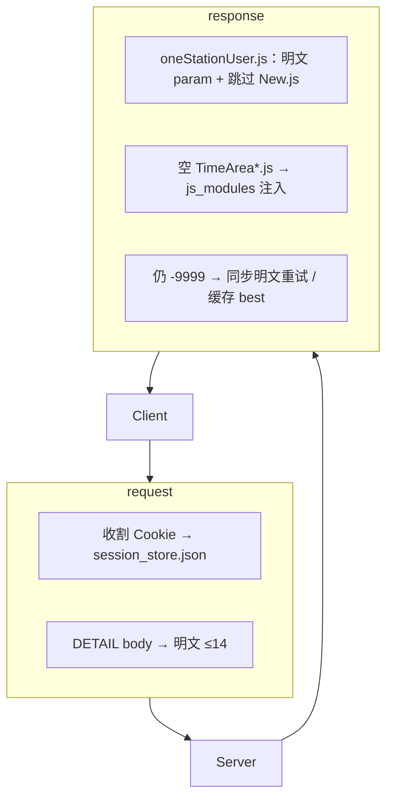

## 背景

PC 微信（以及手机端 H5）打开浙江移动宽带进度里的「查看进度」后，进入 **一站式订单查询** 页面整页白屏。列表本身可以查到「其它群组组网」等订单，问题出在**详情页**。

修复前：


修复后（本例订单最终为已取消，但进度时间线已正常渲染）：


完整工具代码已开源，可直接下载：

**GitHub：<https://github.com/fjh1997/wx-zjmcrm-whitescreen-fix>**  
（Clone / Release ZIP 均可；脚本内订单号、AES 密钥、Cookie 均为占位符，需自行替换。）

> 本文按真实排查时间线书写。早期有过「AESKey 作用域」的误判，且 **`AESKey is not defined` 主要出现在 mitm 注入补丁之后**（补丁对空密钥主动 `throw`），**不是用户最初看到的原始报错**。

<!--more-->

## 现象与排查时间线

结合 Cursor 会话与后续 mitm 抓包，顺序大致是：



| 阶段 | 事实 |
|------|------|
| 初始 | 列表有单；点查看进度 **白屏**。用户侧**没有**先报 `AESKey is not defined` |
| 抓包 | 详情依赖 `QRY_RBOSS_MOBILE_DETAIL`；前端还会 `require` 预约时间段模块 |
| 弯路 | 逆向看到模块内 `var AESKey` 与全局 `aesDecrypt`，曾按「作用域」去注入修复 |
| 次生 | **注入补丁后**补丁内 `if (!window.AESKey) throw new Error('AESKey is not defined')` 把错误「写」到了界面/日志 |
| 实证根因 | ① 详情接口要 **≤14 位明文订单号**；② `showPreTimeAndTimeAreaNew.js` 常 **200 空包** 打断 init |

## 抓包方案（不用 Frida）

Frida / 调试器挂 PC 微信小程序曾导致闪退、进不了业务，最终改用：

- **ProxyBridge**：只把 `Weixin.exe` / `WeChatAppEx.exe` 强制到本机代理  
- **mitmdump :8888**：改写请求体、热补 JS、空模块注入  


仓库内启动方式见 README：  
https://github.com/fjh1997/wx-zjmcrm-whitescreen-fix

## 业务链路（简化）



详情接口形态：

```text
POST .../phone/busi/rboss/broadband/service
     ?isconvert=true&action=QRY_RBOSS_MOBILE_DETAIL
Content-Type: application/json
```

前端原始构造（概念）：

```javascript
var param = {
  preOrderId: aesEncrypt(PRE_ORDER_ID),
  regionId: REGION_ID,
  customerOrderId: aesEncrypt(CUST_ORDER_ID)
};
```

## 根因一：详情接口 max length 14（主因）

自动 fuzz（bootstrap 会话 Cookie 后批量 POST）对比：

| body 中 customerOrderId | 结果 |
|-------------------------|------|
| 32 位 AES Hex 密文（前端默认） | `retCode: "-9999"`，`strings of this type must have a maximum length of 14` |
| **14 位数字明文订单号** | **`retCode: "200"`**，返回 `order` 进度节点 |
| 其它字段改名 / 乱截断 | 多数失败 |

成功请求体（脱敏）：

```json
{
  "preOrderId": "",
  "regionId": "579",
  "customerOrderId": "5790xxxxxxxxxx"
}
```



**结论：以实网为准，该接口当前路径收的是「≤14 字符」形态的订单号；把密文当字段值提交会直接失败。**  
（URL 上的密文订单号仍可用 AES 解出明文，但 POST body 应提交明文 14 位，而不是再 encrypt 一遍的 32 Hex——至少在本环境实测如此。）

mitm 在 `request` 钩子中强制改写：

```python
# 概念代码，完整见仓库 live_fuzz_addon.py
def _rewrite_detail_to_plain(flow):
    body = json.loads(flow.request.get_text(strict=False) or "{}")
    cust = _to_plain_id(body.get("customerOrderId") or "", ORDER_PLAIN)
    new = {
        "preOrderId": _to_plain_id(body.get("preOrderId") or "", "") or "",
        "regionId": str(body.get("regionId") or "579"),
        "customerOrderId": cust[:14],
    }
    flow.request.set_text(json.dumps(new, ensure_ascii=False, separators=(",", ":")))
```

离线脚本 `session_bootstrap_fuzz.py` / `auto_fuzz.py` 用于自动试参，避免反复手动点小程序。

## 根因二：SeaJS 空模块 module was broken

`qryTimeAreaConfig` 在静态配置打开「新预约时间段」时会：

```javascript
if (cache.isNewPreTimeArea) {
  preTimeAndTimeAreaJS = require(
    "rboss/broadband/js/showPreTimeAndTimeAreaNew.js"
  );
}
```

实测：

| 条件 | 响应 |
|------|------|
| 无有效 Cookie / 路径未带上会话 | HTTP **200，body 长度 0** |
| 带有效会话 | 完整 `define(...)` 模块（约 20KB+） |

SeaJS 对空脚本报 `module was broken`，异常可打断 `init`，页面继续白/报初始化失败。



处理（仓库插件已做）：

1. 热补丁 `oneStationUser.js`：**不再 require New.js**，固定走旧模块；  
2. 若 `*.js` 响应空/HTML 错误页：注入 `js_modules/` 下事先用有效会话缓存的完整文件。

## 关于 AESKey：为何文章不能写成「原始根因」

逆向时确实能看到：

```javascript
// 模块内
var AESKey = "";
AESKey = self.qryAESKey();
// 文件后部全局函数
function aesDecrypt(encrypted) {
  var key = CryptoJS.enc.Hex.parse(AESKey); // 读的是全局名
}
```

因此早期结论写成了「PC WebView 作用域导致 AESKey is not defined → 白屏」。

但对照实际过程：

1. **用户最初描述与截图是白屏**，并非先甩出 `AESKey is not defined` 文案；  
2. mitm 补丁为了「显式失败」写了：

```javascript
if (!window.AESKey) {
  throw new Error("AESKey is not defined");
}
```

于是 **注入之后** 日志/页面才稳定出现这句英文错误——这是**补丁制造的可观测错误**，用来提示密钥未就绪，却容易被写成「业务原始 bug」；  
3. 真正让进度数据回来的，是 **DETAIL 明文 14 位** 与 **避开空 New.js**，而不是单靠 `window.AESKey`。

补丁里仍保留 `window.AESKey` / 解密 URL 参数的逻辑，作为辅助（URL 密文订单号要解成 14 位明文），但叙述上应降级为**辅助手段**，不是白屏的第一根因。

## 修复架构（仓库插件）



| 仓库文件 | 作用 |
|----------|------|
| `live_fuzz_addon.py` | mitm 主逻辑 |
| `session_bootstrap_fuzz.py` | 会话 bootstrap + 参数 fuzz |
| `auto_fuzz.py` | 基于 Cookie 批量试参 |
| `js_modules/` | 空包时注入的完整业务 JS |
| `start_proxybridge.ps1` 等 | 代理启停参考 |

下载与说明：

```text
https://github.com/fjh1997/wx-zjmcrm-whitescreen-fix
```

```powershell
git clone https://github.com/fjh1997/wx-zjmcrm-whitescreen-fix.git
cd wx-zjmcrm-whitescreen-fix
pip install mitmproxy pycryptodome
# 编辑脚本中的 YOUR_14_DIGIT_ORDER_ID 等占位符
mitmdump -p 8888 -s .\live_fuzz_addon.py --set block_global=false --ssl-insecure
# 另开 ProxyBridge 强制微信进程走 127.0.0.1:8888
```

## 经验

1. **白屏先抓「有没有详情 JSON」**，再猜前端加密/作用域。  
2. **前端加密 ≠ 网关一定收密文**；fuzz 比猜协议快。  
3. **`module was broken` 先看响应是不是空 body / 错误 HTML**。  
4. **自己注入的 throw 文案不要写进「原始根因」**；区分业务错误与调试补丁错误。  
5. PC 微信小程序优先 **进程级代理**，少碰 Frida。

## 免责声明

仅供个人自有账号排障与研究。勿将中间人改写、会话重放用于未授权系统。密钥与 Cookie 不要提交回仓库。
