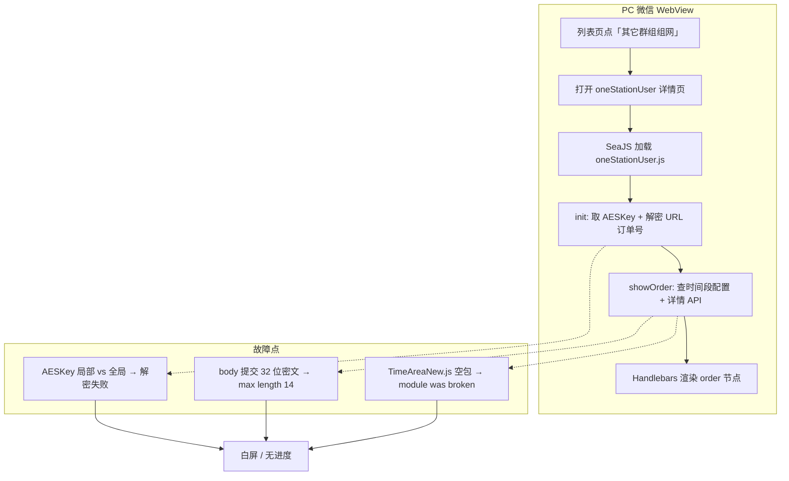
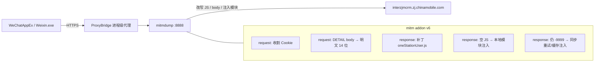
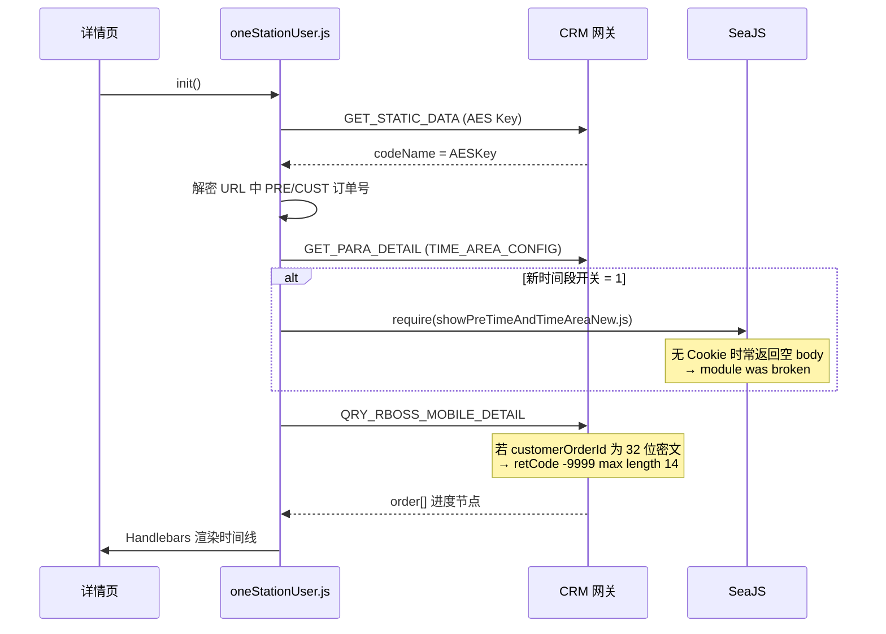
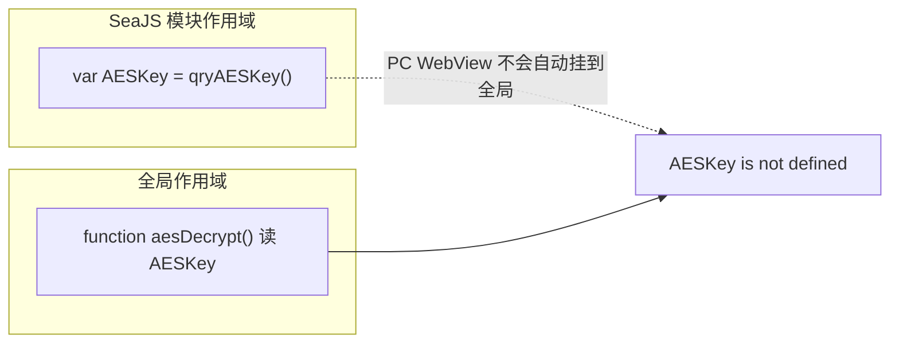
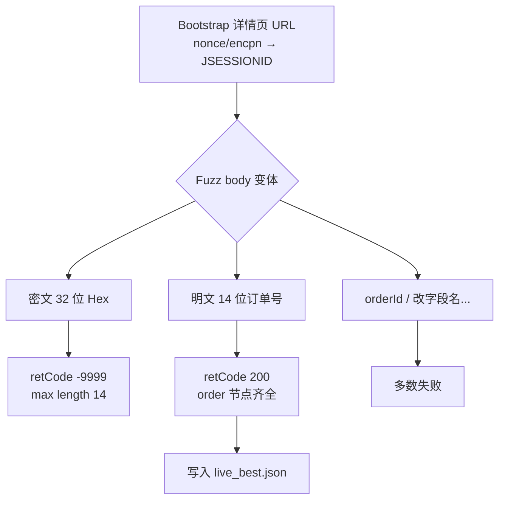
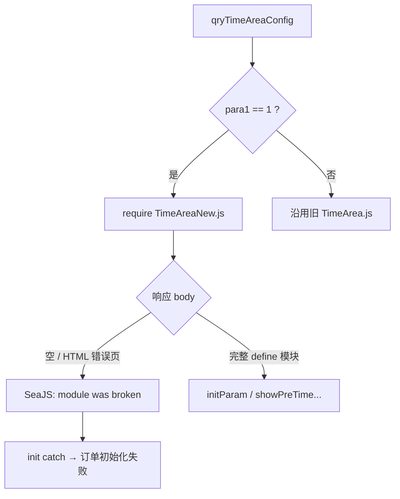
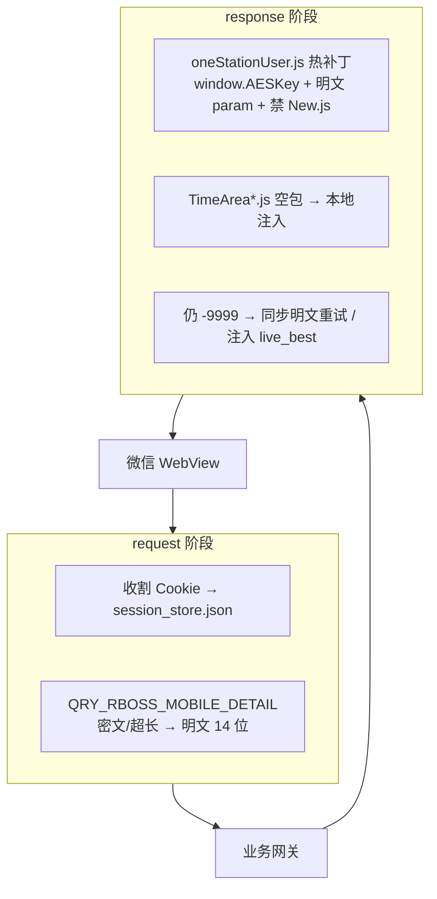

## 背景

PC 微信打开浙江移动相关 H5/小程序业务页（「一站式订单查询」/「其它群组组网」进度详情）时出现**白屏或初始化失败**。列表页在特定地市码下能看到订单入口，点进详情后要么空白，要么提示：

- `AESKey is not defined`
- `strings of this type must have a maximum length of 14`（`retCode: -9999`）
- `订单初始化失败: module was broken: .../showPreTimeAndTimeAreaNew.js`

修复前几乎是整页空白：


修复后可正常渲染进度时间线（本例订单状态为已取消）：


本文记录完整排查过程：如何在 **不依赖 Frida** 的前提下用 ProxyBridge + mitmproxy 强制代理 PC 微信 WebView、如何自动 fuzz 出正确请求体、以及如何把修复固化成可热更新的 mitm 脚本。

> 文中订单号、手机号、会话 Cookie 等已脱敏；AES Key 为业务侧静态配置下发的密钥，仅用于说明加解密流程。

<!--more-->

## 原理总览

整条链路可以概括为三层故障叠加：前端作用域、接口字段形态、SeaJS 模块加载。



抓包与修复架构：



## 环境与约束

| 项 | 说明 |
|----|------|
| 客户端 | Windows PC 微信（Weixin.exe + WeChatAppEx WebView） |
| 业务域 | `interzjmcrm.zj.chinamobile.com` 等 |
| 抓包 | **ProxyBridge** 强制进程走代理 + **mitmproxy/mitmdump** 8888 |
| 禁用 | Frida（曾导致微信闪退/小程序无法进入） |
| 目标 | 详情 API 返回真实进度节点，页面可渲染 |

ProxyBridge 仅把 `Weixin.exe`、`WeChatAppEx.exe` 转到 `http://127.0.0.1:8888`，避免全局代理污染。

## 业务链路

列表页（宽带进度查询）通过接口拿到订单后，拼详情页 URL：

```javascript
// 列表页构造详情入口（逻辑摘要）
gotoUrl =
  ".../page/oneStationUser4Mobile?nonce=..." +
  "&encpn=..." +
  "&extSysCode=20049127&cf=..." +
  "&PRE_ORDER_ID=" + preOrderIdAes +   // URL 上常是 AES 密文
  "&city=" + cityNo +
  "&CUST_ORDER_ID=" + custOrderIdAes;
```

详情页 `oneStationUser.js` 初始化流程：



`srvMap` 关键映射：

```javascript
srvMap.add('oneStationDetail',
  'rboss/broadband/OneStationOrderDetail.json',
  'QRY_RBOSS_MOBILE_DETAIL');
srvMap.add('getStaticData', '', 'GET_STATIC_DATA');
```

详情请求最终打到类似：

```text
POST /page/{ctx}/phone/busi/rboss/broadband/service
     ?isconvert=true&action=QRY_RBOSS_MOBILE_DETAIL
```

## 问题一：AESKey is not defined（白屏）

### 现象

页面空白（见文首白屏截图）；控制台或兜底提示 `AESKey is not defined`。详情接口甚至没发出。

### 分析

```javascript
var AESKey = "";   // 模块内局部变量
AESKey = self.qryAESKey();  // 赋值给局部

function aesEncrypt(data) {
  var key = CryptoJS.enc.Hex.parse(AESKey);  // 全局函数读「全局 AESKey」
}
```



在 PC 微信 WebView 里，`aesEncrypt` / `aesDecrypt` 是**全局函数**，读取的是全局 `AESKey`；而 `qryAESKey` 写回的是模块局部变量 → 密钥取到了，加解密仍失败。

### 方案

mitm 改写 `oneStationUser.js`：

1. 注入 `window.AESKey`，密钥写入全局；
2. 替换 `aesEncrypt` / `aesDecrypt` 为显式使用 `window.AESKey`；
3. 密钥接口失败时使用已抓到的静态密钥兜底（仅调试环境）。

```javascript
window.AESKey = window.AESKey || "";
// 从 GET_STATIC_DATA 的 staticDatas 中 codeValue=="01" 取 codeName
window.AESKey = json.staticDatas[k].codeName;
try { AESKey = window.AESKey; } catch (e) {}

function aesDecrypt(encrypted) {
  if (!window.AESKey) throw new Error("AESKey is not defined");
  var key = CryptoJS.enc.Hex.parse(window.AESKey);
  var srcs = CryptoJS.format.Hex.parse(encrypted);
  var decrypt = CryptoJS.AES.decrypt(srcs, key, {
    iv: "",
    mode: CryptoJS.mode.ECB,
    padding: CryptoJS.pad.Pkcs7
  });
  return CryptoJS.enc.Utf8.stringify(decrypt);
}
```

算法：AES-128-ECB + PKCS7，密文为 **Hex 大写**（与 CryptoJS `ciphertext.toString()` 一致）。

```python
from Crypto.Cipher import AES

def aes_enc(data: str, key_hex: str) -> str:
    key = bytes.fromhex(key_hex)
    raw = (data or "").encode("utf-8")
    pad = 16 - (len(raw) % 16)
    raw += bytes([pad]) * pad
    return AES.new(key, AES.MODE_ECB).encrypt(raw).hex().upper()
```

## 问题二：maximum length of 14（接口 -9999）

### 现象

AES 修好后，详情请求发出，服务端返回：

```json
{
  "retCode": "-9999",
  "retMessage": "strings of this type must have a maximum length of 14"
}
```

前端 `json.order` 为空 → 仍无进度。

### 原前端 body

```javascript
var param = {
  "preOrderId": aesEncrypt(PRE_ORDER_ID),
  "regionId": REGION_ID,
  "customerOrderId": aesEncrypt(CUST_ORDER_ID)
};
```

密文约 32 位 Hex。URL 上的 `CUST_ORDER_ID` 解密后是 **14 位数字订单号**；`PRE_ORDER_ID` 解密后常为空串。

### 自动 fuzz（不靠手动点）

用业务页 bootstrap 拿 `JSESSIONID` 后，批量 POST 多种 body：



| 变体 | 结果 |
|------|------|
| `customerOrderId` = 32 位密文（官方前端形态） | `-9999` max length 14 |
| `customerOrderId` = **14 位明文订单号** | **`retCode: "200"` + order 节点** |
| 仅 `orderId` / 改字段名等 | 多数失败或无进度 |

成功请求体（脱敏）：

```json
{
  "preOrderId": "",
  "regionId": "579",
  "customerOrderId": "5790xxxxxxxxxx"
}
```

结论：该接口在当前网关下对订单号字段按 **最大 14 字符的明文** 校验；把 AES 密文直接当字符串提交会触发 length 错误。

### 方案

mitm 在 `request` 钩子里把 DETAIL body 规范成明文：

```python
def _to_plain_id(val: str, fallback: str = "") -> str:
    v = (val or "").strip()
    if re.fullmatch(r"\d{10,14}", v):
        return v[:14]
    dec = _aes_dec(v)  # 32-hex → 明文
    if dec is not None and len(dec) <= 14:
        return dec
    if re.fullmatch(r"[0-9A-Fa-f]{32,}", v):
        return fallback
    return v[:14] if len(v) > 14 else v

# 改写为：
# {"preOrderId": "", "regionId": "579", "customerOrderId": "14位明文"}
```

同时改 `showOrder` 的 `param` 构造，**不再** `aesEncrypt` 后再提交；对 `json.order` 增加空数组防护。

## 问题三：module was broken（SeaJS 空模块）

### 现象

```text
订单初始化失败: module was broken:
https://interzjmcrm.../busi/rboss/broadband/js/showPreTimeAndTimeAreaNew.js?ver=...
```

### 分析

`qryTimeAreaConfig` 在静态配置打开「新预约时间段」时会：

```javascript
if (cache.isNewPreTimeArea) {
  preTimeAndTimeAreaJS = require(
    "rboss/broadband/js/showPreTimeAndTimeAreaNew.js"
  );
}
```

| 请求条件 | 响应 |
|----------|------|
| 无有效 Cookie / 会话未覆盖 `/busi/` 路径 | HTTP **200，body 长度 0** |
| 带有效会话 Cookie | 完整 `define(function(...){...})`，约 20KB+ |



用 Node 模拟 SeaJS 加载**已下载的完整文件**可导出 `init` / `initParam` / `showPreTimeAndTimeArea`，说明不是语法损坏，而是**传输/鉴权导致空包**。

### 方案（双保险）

1. **业务侧绕过**：强制 `cache.isNewPreTimeArea = false`，永不 `require(New.js)`。  
2. **传输侧兜底**：若 `*.js` 响应空/HTML 错误页，mitm 注入本地缓存的完整模块。

```python
MODULE_FALLBACKS = {
    "showPreTimeAndTimeAreaNew.js": r"...\js_modules\showPreTimeAndTimeAreaNew.js",
    "showPreTimeAndTimeArea.js": r"...\js_modules\showPreTimeAndTimeArea.js",
}

def _body_looks_broken(text: str) -> bool:
    if not text or len(text.strip()) < 50:
        return True
    if text.lstrip().startswith(("<!DOCTYPE", "<html")) or "无法访问" in text:
        return True
    return "define" not in text and "module.exports" not in text
```

## 技术方案总览



目录结构示例：

```text
C:\Users\...\tools\wx_capture\
  live_fuzz_addon.py      # mitmdump -s 入口
  session_store.json      # 自动收割 Cookie
  js_modules\             # 有效会话下缓存的完整 JS
  live_best.json          # 成功详情 JSON
  capture.log / flows.jsonl
  session_bootstrap_fuzz.py
```

启动示例：

```powershell
mitmdump -p 8888 `
  -s C:\Users\...\tools\wx_capture\live_fuzz_addon.py `
  --set block_global=false --ssl-insecure

# ProxyBridge：Weixin.exe;WeChatAppEx.exe → 127.0.0.1:8888
```

## 核心代码摘录

### 详情 body 改写

```python
def _rewrite_detail_to_plain(flow: http.HTTPFlow):
    url = flow.request.pretty_url or ""
    if "QRY_RBOSS_MOBILE_DETAIL" not in url:
        return
    body = json.loads(flow.request.get_text(strict=False) or "{}")
    pre = _to_plain_id(str(body.get("preOrderId") or ""), "")
    cust = _to_plain_id(
        str(body.get("customerOrderId") or body.get("orderId") or ""),
        ORDER_PLAIN_FALLBACK,
    )
    new = {
        "preOrderId": pre or "",
        "regionId": str(body.get("regionId") or "579"),
        "customerOrderId": cust[:14],
    }
    new_text = json.dumps(new, ensure_ascii=False, separators=(",", ":"))
    flow.request.set_text(new_text)
    flow.request.headers["Content-Length"] = str(len(new_text.encode("utf-8")))
```

### 禁用 New.js

```javascript
qryTimeAreaConfig: function (regionId) {
  cache.isNewPreTimeArea = false;
  // 不再 require('.../showPreTimeAndTimeAreaNew.js')
  try {
    Rose.ajax.postJsonSync(srvMap.get("getParaDetail"), param, function () {
      cache.isNewPreTimeArea = false;
    });
  } catch (e) {
    console.warn("[FIX] qryTimeAreaConfig soft-fail", e);
  }
},
```

### 空模块注入

```python
def _inject_js_module(flow: http.HTTPFlow) -> bool:
    url = flow.request.pretty_url or ""
    name = next((k for k in MODULE_FALLBACKS if k in url), None)
    if not name:
        return False
    text = flow.response.get_text(strict=False) or ""
    if not _body_looks_broken(text):
        open(os.path.join(JS_DIR, name), "w", encoding="utf-8").write(text)
        return False
    fb = _read_fallback(name) or (
        _read_fallback("showPreTimeAndTimeArea.js")
        if name.endswith("New.js") else None
    )
    if not fb:
        return False
    flow.response.status_code = 200
    flow.response.set_text(fb)
    flow.response.headers["content-type"] = "application/javascript; charset=utf-8"
    flow.response.headers["cache-control"] = "no-store, no-cache"
    return True
```

## 实网结果（脱敏）

明文 body 下详情接口返回 `retCode: "200"`，`order` 含完整进度节点。页面效果见文首第二张截图。

| 节点 | 含义 |
|------|------|
| 1 | 订单受理 |
| 9 | 装维接单 / 改派 |
| 0 / 0A | 预约施工 |
| 6 | 装机结果（含取消） |

## 经验小结

1. **PC 微信 H5 与手机端同源不同命**：全局变量/模块作用域差异会导致「手机正常、PC 白屏」。  
2. **前端加密 ≠ 网关一定收密文**：以实网响应为准做 fuzz，比猜协议快。  
3. **SeaJS `module was broken` 优先查空响应/HTML 错误页**，不要先怀疑压缩或语法。  
4. **进程级强制代理（ProxyBridge）** 比改系统代理更稳，也比 Frida 少炸客户端。  
5. **mitm 热补丁**适合无源码快速验证；产品侧仍应让服务端/前端正式修复。

## 免责声明

本文仅用于个人业务排障与技术研究。请勿将中间人改写、会话重放用于未授权系统或他人账号。密钥与 Cookie 切勿提交到公开仓库。
