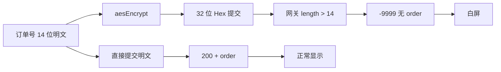

PC / 手机打开浙江移动宽带「查看进度」进入一站式订单详情时整页白屏。列表有单，问题在详情接口字段形态。

**代码**：[https://github.com/fjh1997/wx-zjmcrm-whitescreen-fix](https://github.com/fjh1997/wx-zjmcrm-whitescreen-fix)

**修复前：** 一站式订单详情白屏，无进度内容。


**修复后：** 进度时间线正常展示（本例订单状态为已取消）。


<!--more-->

## 原因

详情页 `showOrder` 提交的是 **AES 加密后的订单号**（约 32 位 Hex），而网关对 `customerOrderId` 按 **原始字符串长度 ≤ 14** 校验。

| 请求体 | 结果 |
|--------|------|
| 32 位密文 | `retCode: -9999`，`maximum length of 14`，无进度数据 |
| **14 位明文订单号** | `retCode: 200`，返回 `order` 进度节点 |

没有 `order` 时，前端仍按成功去渲染 → 空页面 / 白屏。



## 原理

```text
列表「查看进度」
  → 详情 H5 oneStationUser.js
  → param.customerOrderId = aesEncrypt(订单号)   // 多加密了一层
  → POST .../service?action=QRY_RBOSS_MOBILE_DETAIL
  → 网关校验字段长度 ≤ 14（按密文字符串量，不是解密后再量）
  → 失败则无进度节点可画 → 白屏
```

源码等价逻辑：

```javascript
// 问题写法
"customerOrderId": aesEncrypt(CUST_ORDER_ID)  // → 32 字符

// 正确写法（订单号已是 ≤14 位明文时）
"customerOrderId": CUST_ORDER_ID
```

成功请求示例（脱敏）：

```json
{
  "preOrderId": "",
  "regionId": "579",
  "customerOrderId": "5790xxxxxxxxxx"
}
```

## 最简修复

**只做一件事：让详情接口收到 ≤14 位明文订单号。**

### 1. 能改前端时

去掉 `showOrder` 里对订单号的 `aesEncrypt` 即可。

### 2. 不能改源码时（mitm）

仓库里的 `minimal_fix.py`：拦截 `QRY_RBOSS_MOBILE_DETAIL`，把 body 改成明文 14 位。

```powershell
git clone https://github.com/fjh1997/wx-zjmcrm-whitescreen-fix.git
cd wx-zjmcrm-whitescreen-fix
pip install mitmproxy pycryptodome

mitmdump -p 8888 -s .\minimal_fix.py --ssl-insecure --set block_global=false
# 再用 ProxyBridge 把 Weixin.exe / WeChatAppEx.exe 指到 127.0.0.1:8888
```

可选：`$env:ZJ_ORDER_ID="你的14位订单号"` 作兜底。

## 小结

| | |
|--|--|
| **根因** | 详情订单号多做了 AES，字段超长被网关拒绝 |
| **修复** | 提交明文 14 位订单号 |
| **仓库** | [wx-zjmcrm-whitescreen-fix](https://github.com/fjh1997/wx-zjmcrm-whitescreen-fix) |

仅供自有账号排障与学习，请勿用于未授权访问。
