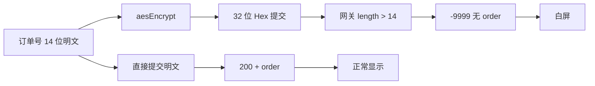

PC / 手机打开浙江移动宽带「查看进度」进入一站式订单详情时整页白屏。列表有单，问题在详情接口字段形态。

**代码**：[https://github.com/fjh1997/wx-zjmcrm-whitescreen-fix](https://github.com/fjh1997/wx-zjmcrm-whitescreen-fix)

**修复前：** 一站式订单详情白屏，无进度内容。


**修复后：** 进度时间线正常展示（本例订单状态为已取消）。


<!--more-->

## 原因

详情页 `showOrder` 提交的是 **AES 加密后的订单号**（约 32 位 Hex），而网关对 `customerOrderId` 按 **原始字符串长度 ≤ 14** 校验。

| 请求体 | 结果 |
|--------|------|
| 32 位密文 | `retCode: -9999`，`maximum length of 14`，无进度数据 |
| **14 位明文订单号** | `retCode: 200`，返回 `order` 进度节点 |

没有 `order` 时，前端仍按成功去渲染 → 空页面 / 白屏。



## 原理

```text
列表「查看进度」
  → 详情 H5 oneStationUser.js
  → param.customerOrderId = aesEncrypt(订单号)   // 多加密了一层
  → POST .../service?action=QRY_RBOSS_MOBILE_DETAIL
  → 网关校验字段长度 ≤ 14（按请求体字符串量，不是解密后再量）
  → 失败则无进度节点可画 → 白屏
```

前端问题写法 vs 正确写法：

```javascript
// 问题：加密后 32 字符，网关直接拒
var param = {
  "preOrderId": aesEncrypt(PRE_ORDER_ID),
  "regionId": REGION_ID,
  "customerOrderId": aesEncrypt(CUST_ORDER_ID)
};

// 正确：提交 ≤14 位数字明文（URL 侧若已解密完成）
var param = {
  "preOrderId": "",
  "regionId": REGION_ID,
  "customerOrderId": CUST_ORDER_ID  // 例如 "5790xxxxxxxxxx"
};
```

成功请求体（脱敏）：

```json
{
  "preOrderId": "",
  "regionId": "579",
  "customerOrderId": "5790xxxxxxxxxx"
}
```

## 修复

**只做一件事：让详情接口收到 ≤14 位明文订单号。**

### 1. 能改前端

去掉 `showOrder` 里对订单号的 `aesEncrypt`，并保证 `customerOrderId` 为 10～14 位数字。

### 2. 不能改源码（mitm）

用仓库中的 `minimal_fix.py`：

1. **请求改写**：命中 `QRY_RBOSS_MOBILE_DETAIL` 时，把 body 改成明文 14 位（按 **action 路径** 命中，不依赖域名；Host 显示为 IP 时也能改）；  
2. **JS 热补**：`oneStationUser.js` 组参不再 `aesEncrypt`，并带上 `retCode` 判断。

核心请求改写：

```python
def request(flow):
    if "QRY_RBOSS_MOBILE_DETAIL" not in (flow.request.pretty_url or ""):
        return
    body = json.loads(flow.request.get_text(strict=False) or "{}")
    # 密文则 AES 解回数字；解不出则用配置的 14 位订单号
    cust = to_plain_order(body.get("customerOrderId") or "")
    new = {
        "preOrderId": "",
        "regionId": str(body.get("regionId") or "579"),
        "customerOrderId": cust,  # 必须是 ≤14 位数字
    }
    text = json.dumps(new, ensure_ascii=False, separators=(",", ":"))
    flow.request.set_text(text)
```

核心 JS 热补（概念）：

```python
# 把 aesEncrypt(PRE/CUST) 换成明文组参
# "customerOrderId": aesEncrypt(CUST_ORDER_ID)
#   → "customerOrderId": "5790xxxxxxxxxx"
```

#### 操作步骤（按这个顺序）

```powershell
git clone https://github.com/fjh1997/wx-zjmcrm-whitescreen-fix.git
cd wx-zjmcrm-whitescreen-fix
pip install mitmproxy pycryptodome

# 1) 设订单号兜底（强烈建议；AES 解不出时靠它）
$env:ZJ_ORDER_ID="你的14位订单号"
# 可选：$env:ZJ_AES_KEY="从 GET_STATIC_DATA 拿到的密钥"

# 2) 启动 mitm（推荐仓库脚本，保证 env 传入子进程）
.\start_minimal.ps1
# 等价手动：cmd /c "set ZJ_ORDER_ID=你的14位订单号&& mitmdump -p 8888 -s minimal_fix.py --ssl-insecure --set block_global=false"

# 3) ProxyBridge 必须以【管理员】运行
#    Weixin.exe / WeChatAppEx.exe → 127.0.0.1:8888
#    非管理员会立刻退出 = 等于没挂代理

# 4) 完全退出微信 PC 端再打开 → 一站式订单 → 查看进度
```

#### 验收（必看）

打开仓库目录下的 `minimal_fix.log`：

| 日志 | 含义 |
|------|------|
| `DETAIL body -> plain {...}` | 改写已生效 |
| `DETAIL resp retCode=200` | 网关返回进度 |
| `rewrote oneStationUser.js` | JS 热补命中 |
| **只有 `ready`，没有 DETAIL** | 流量没进 mitm：检查管理员 ProxyBridge、是否重启微信 |

#### 常见翻车

| 现象 | 原因 | 处理 |
|------|------|------|
| 一直白屏 | 代理没挂上 / 未重启微信 | 管理员 PB + 杀干净微信 |
| `WARN: no plain order id` | 未设 `ZJ_ORDER_ID` 且解不出密文 | 设订单号后重启 mitmdump |
| 系统异常 /「请输入正确的 URL」 | 乱改 Host/CONNECT 把其它站点指到 CRM | **不要**把 `218.205.68.*` 全改成 CRM 域名（如 `wap.zj.10086.cn` 会被搞挂） |
| 证书报错 | 未信任 mitm CA | 安装 mitmproxy CA 到受信任根证书 |

## 小结

| | |
|--|--|
| **根因** | 详情订单号多做了 AES，字段超长被网关拒绝 |
| **修复** | 提交明文 14 位订单号 |
| **落地** | 管理员进程代理 + mitm 改 body；以 `minimal_fix.log` 的 `DETAIL body -> plain` 为成功标志 |
| **仓库** | [wx-zjmcrm-whitescreen-fix](https://github.com/fjh1997/wx-zjmcrm-whitescreen-fix) |

仅供自有账号排障与学习，请勿用于未授权访问。
