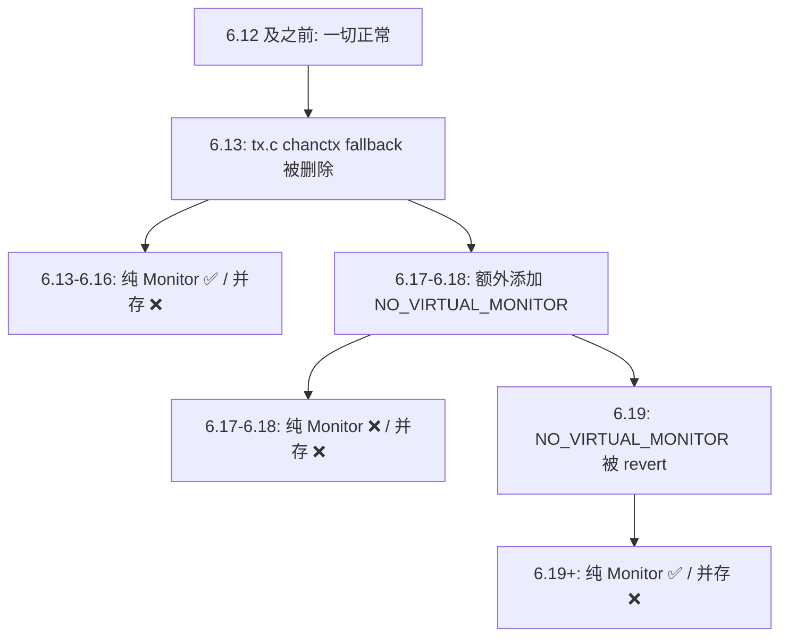

## 起因

我有一个 Fenvi AX1800 USB 无线网卡（芯片 MediaTek MT7921AU，驱动 mt76），平时用来做无线安全研究。某天升级内核后发现，网卡在监控模式下抓不到管理帧了。

具体表现是：当无线网卡同时存在 managed 接口和 monitor 接口时（即并存模式），monitor 接口完全抓不到任何帧。而在内核 6.12 及以前，这一切都是正常的。

在 GitHub 上搜索发现已经有人报告了同样的问题：[USB-WiFi#682](https://github.com/morrownr/USB-WiFi/issues/682)，但一直没有修复。于是决定自己动手调试。

## 环境搭建

我的调试环境是：

- **宿主机**：Windows + VMware Workstation
- **虚拟机**：Ubuntu 24.04 LTS（默认内核 6.8）
- **无线网卡**：Fenvi AX1800（MT7921AU），通过 USB 穿透到虚拟机
- **内核版本**：通过 Ubuntu Mainline Kernel 安装多个版本进行对比测试

选择 Ubuntu 的原因是 [Ubuntu Mainline Kernel Archive](https://kernel.ubuntu.com/mainline/) 提供了预编译的 `.deb` 内核包，可以非常方便地安装任意版本的内核来测试，不需要自己从头编译整个内核。

安装方法很简单，以 6.13 为例：

```bash
cd /tmp
wget https://kernel.ubuntu.com/mainline/v6.13/amd64/linux-headers-6.13.0-061300-generic_6.13.0-061300.202501192034_amd64.deb
wget https://kernel.ubuntu.com/mainline/v6.13/amd64/linux-headers-6.13.0-061300_6.13.0-061300.202501192034_all.deb
wget https://kernel.ubuntu.com/mainline/v6.13/amd64/linux-image-unsigned-6.13.0-061300-generic_6.13.0-061300.202501192034_amd64.deb
wget https://kernel.ubuntu.com/mainline/v6.13/amd64/linux-modules-6.13.0-061300-generic_6.13.0-061300.202501192034_amd64.deb
sudo dpkg -i *.deb
sudo reboot
```

## 基线测试：确认 Bug 存在

先在默认的 6.8 内核上确认网卡功能正常。

### 测试方法

两种场景分别测试：

**场景一：纯 Monitor 模式**

```bash
sudo ip link set wlx18d6c70a4715 down
sudo iw dev wlx18d6c70a4715 set type monitor
sudo ip link set wlx18d6c70a4715 up
sudo timeout 5 tcpdump -i wlx18d6c70a4715 -c 50 'type mgt' -n
```

**场景二：Managed + Monitor 并存**

```bash
sudo ip link set wlx18d6c70a4715 up  # managed 模式
sudo iw dev wlx18d6c70a4715 interface add mon0 type monitor
sudo ip link set mon0 up
sudo timeout 5 tcpdump -i mon0 -c 50 'type mgt' -n
```

### 6.8 基线结果

| 场景 | 结果 |
|------|------|
| 纯 Monitor | ✅ 正常抓到管理帧 |
| Managed + Monitor | ✅ 正常抓到管理帧 |

一切正常。然后切换到 6.13 内核。

### 6.13 测试结果

| 场景 | 结果 |
|------|------|
| 纯 Monitor | ✅ 正常 |
| Managed + Monitor | ❌ 0 帧 |

Bug 确认。并存模式下完全抓不到帧。

## 定位根因

### 快速编译策略

调试内核 bug 最头疼的就是编译时间。完整编译一个内核可能需要几十分钟甚至几个小时。但实际上我们只需要修改 `mac80211` 模块，所以可以只编译这一个模块：

```bash
cd /root/kernel/linux-6.13
cp /boot/config-$(uname -r) .config
make olddefconfig
make modules_prepare
cp /lib/modules/$(uname -r)/build/Module.symvers .
make M=net/mac80211 modules  # 只编译 mac80211，大约 30 秒
```

然后热替换模块，不需要重启：

```bash
sudo ip link set wlx18d6c70a4715 down
sudo rmmod mt7921u mt7921_common mt792x_lib mt76_connac_lib mt76_usb mt76 mac80211
sudo insmod net/mac80211/mac80211.ko
sudo modprobe mt7921u
```

这样每次修改代码到测试验证的周期只需要不到一分钟。

### 分析代码变更

问题出在 `net/mac80211/tx.c` 的 `ieee80211_monitor_start_xmit()` 函数。这是监控模式下发送（注入）帧的入口。

通过 `git log` 追踪，找到了引入回归的 commit：

> `0a44dfc07074` ("wifi: mac80211: simplify non-chanctx drivers")

这个 commit 在"简化"代码时，删除了一个关键的 fallback 路径。修改前的逻辑（简化表示）：

```c
if (chanctx_conf)
    chandef = &chanctx_conf->def;
else
    chandef = &local->_oper_chandef;  // fallback
```

修改后：

```c
if (chanctx_conf)
    chandef = &chanctx_conf->def;
else if (local->emulate_chanctx)
    chandef = &local->hw.conf.chandef;
else
    goto fail_rcu;  // 直接失败！
```

问题在于：对于使用"真正的"channel context 的驱动（如 mt76），当 monitor 接口和 managed 接口并存时，monitor 的虚拟接口（sdata）并不会被分配自己的 chanctx，即使系统中存在一个来自 managed 接口的活跃 chanctx。

之前的代码会 fallback 到 `local->_oper_chandef`，所以能正常工作。新代码直接 `goto fail_rcu`，静默丢弃了所有帧。

后来的 commit `d594cc6f2c58` ("wifi: mac80211: restore non-chanctx injection behaviour") 修复了使用 `emulate_chanctx` 的驱动，但**明确留下了真正 chanctx 驱动未修复**。

### 修复方案

修复思路很直接：当 monitor 接口没有 chanctx 时，从 `local->chanctx_list` 中取第一个可用的 chanctx 作为 fallback。这个模式在 `ieee80211_hw_conf_chan()` 中已经被使用过了，是安全的。

```c
if (chanctx_conf) {
    chandef = &chanctx_conf->def;
} else if (local->emulate_chanctx) {
    chandef = &local->hw.conf.chandef;
} else {
    /*
     * For real chanctx drivers (e.g. mt76), the monitor
     * interface may not have a chanctx assigned when running
     * concurrently with another interface. Fall back to any
     * active chanctx so that injection can still work on the
     * operating channel.
     */
    struct ieee80211_chanctx *ctx;

    ctx = list_first_entry_or_null(&local->chanctx_list,
                                   struct ieee80211_chanctx,
                                   list);
    if (ctx)
        chandef = &ctx->conf.def;
    else
        goto fail_rcu;
}
```

## 跨版本验证

仅修复一个版本是不够的。我需要确认这个补丁能修复所有受影响的版本。

### 源码级分析

为了避免在每个版本上都走一遍完整的"安装内核→重启→编译→测试"流程，我先从 kernel.org 下载了各版本的 `tx.c` 源码进行对比分析：

```bash
# 下载各版本的 tx.c 进行对比
for ver in 6.13 6.14 6.15 6.16 6.17 6.18 6.19; do
    curl -o tx_${ver}.c "https://git.kernel.org/pub/scm/linux/kernel/git/stable/linux.git/plain/net/mac80211/tx.c?h=v${ver}"
done
```

分析发现：
- **6.13–6.18**：没有 `emulate_chanctx` 分支，直接 `if/else goto fail_rcu`
- **6.19+**：有 `emulate_chanctx` 分支（来自 `d594cc6f2c58`），但 else 仍然 `goto fail_rcu`

两种变体都需要同样的修复，只是上下文略有不同。我的补丁基于 6.19+ 的代码编写，通过 `Fixes:` 标签和 `Cc: stable@vger.kernel.org` 来触发自动回溯。

### 发现第二个 Bug

在 6.18 内核上测试时，发现了一个意外情况：**即使是纯 Monitor 模式也抓不到帧**。这跟 6.13 的表现不同（6.13 纯 Monitor 是正常的）。

经过排查，发现 6.17–6.18 的 mt76 驱动中多了一行：

```c
// drivers/net/wireless/mediatek/mt76/mt792x_core.c
ieee80211_hw_set(hw, NO_VIRTUAL_MONITOR);
```

这个标志告诉 mac80211 不要创建虚拟 monitor 接口，导致整个监控模式都不工作。这个标志在 6.19 中被 revert 了。

所以实际上有**两个独立的 Bug**：



### 完整测试结果

在代表性版本上进行了实际测试：

**补丁前：**

| 内核版本 | 纯 Monitor | Managed + Monitor | 原因 |
|---------|-----------|-------------------|------|
| 6.8 | ✅ 正常 | ✅ 正常 | 基线 |
| 6.13 | ✅ 正常 | ❌ 0 帧 | Bug 1 |
| 6.17 | ❌ 0 帧 | ❌ 0 帧 | Bug 1 + Bug 2 |
| 6.18 | ❌ 0 帧 | ❌ 0 帧 | Bug 1 + Bug 2 |
| 6.19 | ✅ 正常 | ❌ 0 帧 | Bug 1 |
| 7.0-rc2 | ✅ 正常 | ❌ 0 帧 | Bug 1 |

**补丁后（tx.c 修复）：**

| 内核版本 | 纯 Monitor | Managed + Monitor |
|---------|-----------|-------------------|
| 6.13 | ✅ 正常 | ✅ ~37 帧/5秒 |
| 6.19 | ✅ 正常 | ✅ ~39 帧/5秒 |
| 7.0-rc2 | ✅ 正常 | ✅ ~33 帧/5秒 |

## 提交上游补丁

确认修复有效后，按照 Linux 内核贡献流程提交补丁。

### 生成补丁

```bash
cd /root/kernel/linux-7.0-rc2
# 编辑 net/mac80211/tx.c 应用修复
git add net/mac80211/tx.c
git commit -s  # Signed-off-by 是必须的
git format-patch -1
```

### checkpatch 检查

```bash
./scripts/checkpatch.pl 0001-wifi-mac80211-fix-monitor-mode-frame-capture-for-rea.patch
# total: 0 errors, 0 warnings, 41 lines checked
```

### 获取维护者列表

```bash
./scripts/get_maintainer.pl 0001-wifi-mac80211-fix-monitor-mode-frame-capture-for-rea.patch
```

输出的维护者和邮件列表就是你需要抄送的对象。

### 发送补丁

```bash
git send-email \
    --to=linux-wireless@vger.kernel.org \
    --cc=johannes@sipsolutions.net \
    --cc=stable@vger.kernel.org \
    0001-wifi-mac80211-fix-monitor-mode-frame-capture-for-rea.patch
```

补丁中的关键标签：
- `Fixes: 0a44dfc07074` — 指明修复哪个 commit 引入的 bug
- `Cc: stable@vger.kernel.org` — 请求回溯到受影响的 stable 分支

补丁已发送到邮件列表：[lore.kernel.org 链接](https://lore.kernel.org/linux-wireless/20260308164510.5927-1-fjhhz1997@gmail.com/T/#u)

## 调试过程中的坑

### 1. Module.symvers 缺失

只编译单个模块时，如果不复制 `Module.symvers`，加载时会报 `undefined symbol` 错误：

```bash
cp /lib/modules/$(uname -r)/build/Module.symvers .
```

### 2. 模块热替换的顺序

卸载模块时要注意依赖关系，需要先卸载依赖 mac80211 的驱动模块：

```bash
# 查看依赖关系
lsmod | grep mac80211
# mt7921u → mt7921_common → mt792x_lib → mt76_connac_lib → mt76 → mac80211

# 按依赖顺序卸载
sudo rmmod mt7921u mt7921_common mt792x_lib mt76_connac_lib mt76_usb mt76 mac80211
# 加载修改后的模块
sudo insmod net/mac80211/mac80211.ko
sudo modprobe mt7921u  # 自动加载整个 mt76 驱动链
```

### 3. 脏模块状态

多次热替换模块后，偶尔会出现模块状态异常（表现为补丁明明应该生效但实际没效果）。遇到这种情况，做一次完整的卸载-重载循环即可：

```bash
sudo rmmod mt7921u mt7921_common mt792x_lib mt76_connac_lib mt76_usb mt76 mac80211 cfg80211
sudo modprobe mac80211  # 加载原版
sudo rmmod mac80211
sudo insmod net/mac80211/mac80211.ko  # 加载修改版
sudo modprobe mt7921u
```

### 4. 补丁的版本兼容性

我的补丁是基于最新主线（7.0-rc2）编写的，其中包含 `emulate_chanctx` 分支。但 6.13–6.18 的内核没有这个分支，所以补丁不能直接 `git apply`。

不过这不影响上游提交——补丁只需要能在当前主线上 apply 即可。stable 团队在回溯时会自行处理冲突，或者我可以在需要时提供针对特定版本的 backport。

## 总结

这次调试的收获：

1. **只编译单个模块**是调试内核 bug 的高效方法，配合模块热替换可以做到分钟级的修改-测试循环
2. 看似一个 bug 实际可能是**多个独立回归的叠加**，需要跨版本源码对比才能理清
3. Ubuntu Mainline Kernel 配合 VMware 快照是一个非常方便的多内核测试环境
4. Linux 内核的补丁提交流程其实并不复杂：`git format-patch` → `checkpatch.pl` → `get_maintainer.pl` → `git send-email`
