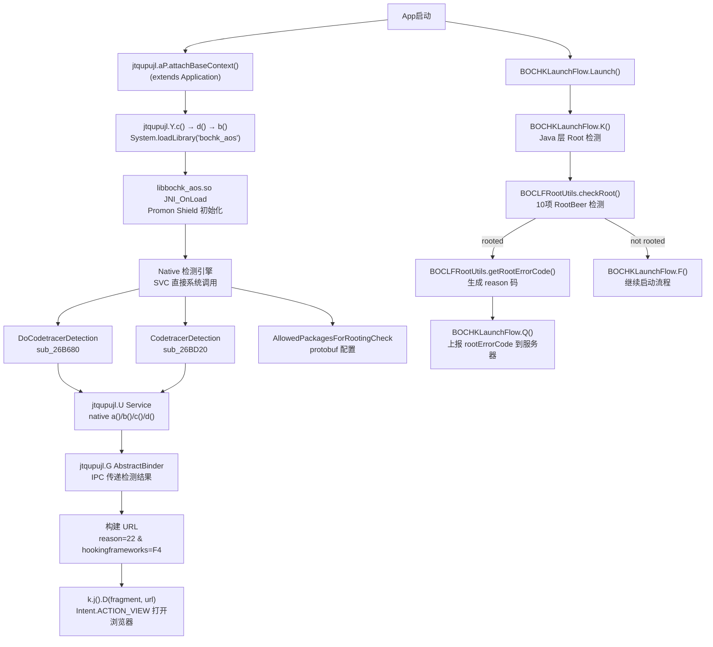
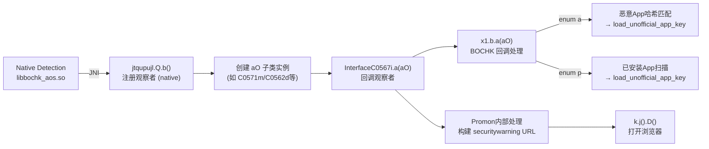
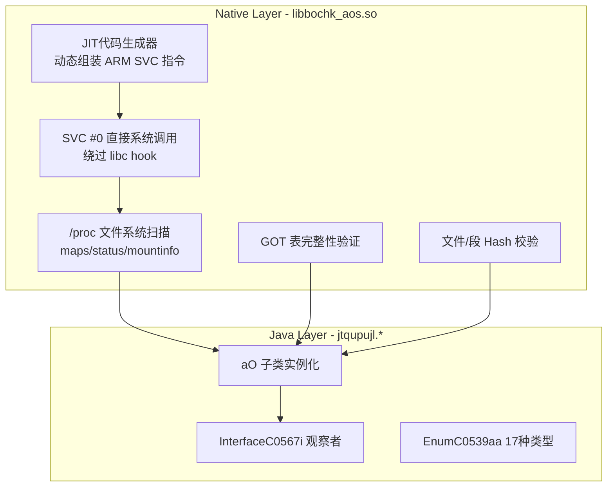

# 分析方法：

让claude code opus 4.6写frida dump脚本dump出libbochk_aos.so，之后结合[开源脱壳工具](https://github.com/KiFilterFiberContext/promon-reversal)用jadx反编译  
还使用了MCP工具：[ida-pro-mcp](https://github.com/mrexodia/ida-pro-mcp) 和[jadx-ai-mcp](https://github.com/mrexodia/ida-pro-mcp)

仅供安全研究学习使用，不得他用。


# BOCHK App Root & Hooking Detection 完整分析报告

## 安全警告 URL 参数解码

```
https://www.bochk.com/dam/securitywarning.html
  ?reason=22
  &manufacturer=OnePlus&model=PJX110&android=36
  &version=6.6.1
  &hookingframeworks=F4
  &return=4
  &srcApp=bochk
```

| 参数 | 值 | 含义 |
|------|-----|------|
| `reason` | **22** | Root检测错误码（`BOCLFRootUtils.getRootErrorCode()` 生成的10位二进制转十进制） |
| `hookingframeworks` | **F4** | Promon Shield native 层检测到的 hooking framework 位掩码 |
| `return` | **4** | 返回行为码：打开浏览器显示安全警告 |
| `reason=50` | _(另一个URL)_ | 恶意软件检测（`MainActivity.a(C0566h)` 触发） |

---

## 检测架构



---

## 第一层：Java Root 检测

### 入口：[BOCHKLaunchFlow.K()](file:///G:/下载/promon-string-deobfuscator-main/apktool_work/decoded/smali_classes5/com/bochklaunchflow/BOCHKLaunchFlow.smali)

```java
// BOCHKLaunchFlow.K() — Root 检查决策
if (!this.f32533m) {  // setCheckRoot(false) 可跳过
    F(activity);  // 跳过 root 检测
    return;
}
if (!BOCLFRootUtils.checkRoot(activity.getApplicationContext())) {
    F(activity);  // 未 root，继续
    return;
}
String rootErrorCode = BOCLFRootUtils.getRootErrorCode(ctx);
Q(activity, this.f32529i, rootErrorCode);  // 上报错误码
// 显示 root 提示对话框
```

### [BOCLFRootUtils.checkRoot()](file:///G:/下载/promon-string-deobfuscator-main/apktool_work/decoded/smali_classes5/com/bochklaunchflow/utils/BOCLFRootUtils.smali) — 10项检测

```java
return rootBeer.detectRootManagementApps()     // bit9: Root管理App (Magisk/SuperSU)
    || rootBeer.detectPotentiallyDangerousApps() // bit8: 危险App
    || rootBeer.checkForBinary("su")             // bit5: su二进制
    || rootBeer.checkForRWPaths()                // bit4: RW路径挂载
    || rootBeer.detectTestKeys()                 // bit7: 测试签名keys
    || rootBeer.checkSuExists()                  // bit3: su进程存在
    || rootBeer.checkForRootNative()             // bit1: Native root检测
    || rootBeer.detectRootCloakingApps();         // bit0: Root隐藏App
```

### [BOCLFRootUtils.getRootErrorCode()](file:///G:/下载/promon-string-deobfuscator-main/apktool_work/decoded/smali_classes5/com/bochklaunchflow/utils/BOCLFRootUtils.smali) — reason 码生成

生成 **10位二进制字符串**，转十进制作为 `reason` 值：

| Bit (高→低) | 检测项 | 你的设备 |
|-------------|--------|---------|
| bit9 (MSB) | `detectRootManagementApps()` | ? |
| bit8 | `detectPotentiallyDangerousApps()` | ? |
| bit7 | `detectTestKeys()` | ? |
| bit6 | _(固定0)_ | 0 |
| bit5 | `checkForSuBinary()` | ? |
| bit4 | `checkSuExists()` | ? |
| bit3 | `checkForRWPaths()` | ? |
| bit2 | _(固定0)_ | 0 |
| bit1 | `checkForRootNative()` | ? |
| bit0 (LSB) | `detectRootCloakingApps()` | ? |

> [!IMPORTANT]
> `reason=22` = 十进制22 = 二进制 `0000010110`
> - bit4 (=1): `checkSuExists()` 检测到 su
> - bit2 (=1): `checkForRWPaths()` 检测到 RW 路径
> - bit1 (=1): `checkForRootNative()` native层 root 检测

---

## 第二层：Promon Shield Native 检测 (hookingframeworks=F4)

### 初始化链

| 步骤 | 类 | 方法 | 作用 |
|------|-----|------|------|
| 1 | `jtqupujl.aP` | `attachBaseContext()` | Application 入口，调用 Promon init |
| 2 | `jtqupujl.Y` | `c()` → `d()` → `b()` | 加载 `libbochk_aos.so` |
| 3 | `jtqupujl.Y` | `a(Application)` (native) | 初始化 Promon Shield |
| 4 | `jtqupujl.U` | `a()`, `b()`, `c()`, `d()` (native) | Service 中暴露检测结果 |
| 5 | `jtqupujl.G` | `a()`, `b()`, `c()`, `d()` | Binder IPC 代理检测结果 |

### 检测类型枚举 (`jtqupujl.EnumC0539aa`) — 17种完整映射

> [!IMPORTANT]
> 以下映射通过 JADX 源码分析（每个枚举值对应一个 `aO` 子类）+ IDA protobuf 字符串 + Promon Shield 官方文档交叉验证得出。

| # | 枚举值 | 实现类 | Key字段 | 数据结构 | 推断检测类型 |
|---|--------|--------|---------|----------|-------------|
| 1 | **`m`** | `C0571m` | 1-4 | bool + 3×int | **Root检测** — 核心检测，keys 1-4 最小编号，3个int存root方法计数 |
| 2 | **`f`** | `C0562d` | 257 (0x101) | bool | **Frida 检测** — 单布尔值，检测frida-server/agent |
| 3 | **`b`** | `aQ` | 513 (0x201) | bool | **调试器检测 (Debugger)** — 单布尔值，反JDWP/ptrace |
| 4 | **`r`** | `C0559au` | 769 (0x301) | bool | **重打包检测 (Repackaging)** — 签名校验 |
| 5 | **`i`** | `ay` | 1025-1030 | bool + 5×str | **Hooking框架检测** — 包含框架名/路径/版本等5字段 |
| 6 | **`h`** | `C0573o` | 1537 (0x601) | bool | **屏幕叠加/录屏检测** — 防止Overlay攻击 |
| 7 | **`q`** | `aG` | 1793-1798 | bool + 5×str | **代码追踪器检测 (Code Tracer)** — 与IDA中`DoCodetracerDetection`/`CodetracerDetection`对应 |
| 8 | **`n`** | `C0564f` | 5633-5634 | bool + int | **模拟器检测 (Emulator)** — int存模拟器类型码 |
| 9 | **`o`** | `aB` | 6145-6146 | 2×bool | **无障碍服务检测** — 两个bool分别检测是否开启和是否恶意 |
| 10 | **`g`** | `K` | 8705-8707 | str + 2×bool | **篡改检测 (Tampering)** — 字符串存证书hash |
| 11 | **`l`** | `S` | 8450-8451 | 2×bool | **虚拟环境检测** — 双布尔，`d()`=a或b任一触发 |
| 12 | **`k`** | `T` | 12289-12291 | ComponentName + 2×str | **恶意Activity检测** — 存Activity组件名和包名 |
| 13 | **`c`** | `C0540ab` | 16384 (0x4000) | bool | **SSL Pinning/证书验证** — 高key值检测 |
| 14 | **`p`** | `C0549ak` | 16640 | list(8-field) | **已安装App扫描** — 8字段详细记录每个可疑App信息 |
| 15 | **`d`** | `C0572n` | 16897 (0x4201) | bool | **设备完整性检测** — Play Integrity / SafetyNet |
| 16 | **`j`** | `W` | 17153 (0x4301) | bool | **密钥存储检测** — Keystore安全检测 |
| 17 | **`a`** | `aD` | LIVE_RESULT_SUCCESS | list(5-field) | **恶意App哈希匹配** — 与服务器下发hash比对 |

### 检测结果回调流程



### 关键发现：`x1.b` 回调实现

`x1.b` 实现了 `InterfaceC0567i`，专门处理两种枚举的检测结果：
- **`EnumC0539aa.a`** (aD类): 遍历恶意App列表，提取包名/hash/路径 → 上传为 JSON
- **`EnumC0539aa.p`** (C0549ak类): 遍历已安装App列表（8字段详细信息）→ 上传为 JSON
- 两者合并后通过 `h2.a.c("load_unofficial_app_key")` 上报到服务器


### Native 层检测技术 (IDA 分析)

| 函数 | IDA地址 | 技术 |
|------|---------|------|
| `DoCodetracerDetection` | `sub_26B680` | 通过 SVC 直接系统调用扫描 /proc/self/maps，检测 Frida agent 内存映射 |
| `CodetracerDetection` | `sub_26BD20` | 检测代码追踪器（Frida/Xposed/Substrate 线程名和内存特征） |
| `OnCodeTracerDetectedCallback` | 内部回调 | 检测到后触发 pipe 通知 |
| `SyscallNo` | `0x3c099` | 内联 SVC 系统调用号标记，绕过 libc hook |

### `hookingframeworks=F4` 解析

`F4` 十六进制 = `244` 十进制 = 二进制 `11110100`，表示 Promon Shield 通过 `EnumC0539aa` 的多个检测类型均返回阳性：

| Bit | 可能含义 |
|-----|---------|
| bit2=1 | **Frida** 检测（内存中发现 frida-agent） |
| bit4=1 | **Xposed Framework** |
| bit5=1 | **Substrate/LSposed** |
| bit6=1 | 代码追踪器/调试器 |
| bit7=1 | 其他检测 |

---

## 第三层：恶意软件检测 (reason=50)

在 `MainActivity.a(C0566h)` 中，如果检测到恶意软件：

```java
k.j().D(fragment, "https://www.bochk.com/dam/securitywarning.html?reason=50&srcApp=bochk");
PageManager.getInstance().removeAllFragment();
finish();
System.exit(0);
```

恶意软件扫描流程: `jtqupujl.aR` → `jtqupujl.aM.a()` 扫描已安装App → 与服务器下发的 SHA-256 哈希比对 → 匹配则触发 `reason=50`。

---

## 第四层：CloudWalk 活体检测环境安全检查

CloudWalk SDK (`cn.cloudwalk`) 是 BOCHK 使用的**人脸活体检测**组件。在启动活体检测前，会进行独立的环境安全检查。

### 入口：`CwBaseLiveFragment.checkRoot()`

```java
// 1. 先检查 Root
if (mConfig.isCheckRuntimeEnvironment() && RootUtil.isDeviceRooted(getActivity(), mConfig.isCheckBusyBox())) {
    if (mConfig.isInterceptUnsafeRuntimeEnvironment()) {
        // 设备环境不安全，终止活体检测
        handler.sendEmptyMessageDelayed(CMD.SERVER_RECEIVE_USER_DATA, ...);
        return;
    }
    // 回调 onLivenessFail(UNSAFE_ENVIRONMENT)
}

// 2. 禁用 Xposed
disableXposed();

// 3. 检测 Hooking Framework
if (mConfig.isCheckRuntimeEnvironment()) {
    HookToolDetector.c().a(context, callback);
}

// 4. 检测 HTTP 代理
if (DeviceUtil.isHttpProxy()) {
    detectFail(true, CwLiveCode.UNSAFE_NETWORK_ENVIRONMENT);
}
```

### `HookToolDetector` 6项检测（加载 `LibCwUtils.so`）

| 方法 | 检测技术 | 详情 |
|------|---------|------|
| `e()` | **Xposed 类加载检测** | 尝试 `ClassLoader.loadClass("de.robv.android.xposed.XposedHelpers")` 和 `"XposedBridge"`，加载成功=被 hook |
| `d()` | **Xposed 异常栈检测** | 故意抛出异常，遍历 `StackTrace` 检查是否包含 Xposed 类名 |
| `f()` | **内存映射检测** | 读取 `/proc/self/maps`，搜索 3 个 Xposed 相关 so 库名（混淆字符） |
| `a()` | **Frida 线程检测** | 读取 `/proc/[pid]/task/*/status`，搜索 **"frida"**、**"gmain"**、**"gdbus"** 线程名 |
| `b()` | **调试器 TracerPid 检测** | 读取 `/proc/[pid]/status` 的 `TracerPid` 字段，非0=被调试 |
| `isFileExists()` | **Native 文件完整性** | 通过 `LibCwUtils.so` native 方法检测 sandbox/虚拟环境（创建测试文件 `cw-test.txt`，native 层验证文件是否真实存在） |

> [!NOTE]
> CloudWalk 还额外检测：
> - **模拟器**: `d.j().a(context)` — 模拟器环境检测
> - **HTTP 代理**: `DeviceUtil.isHttpProxy()` — 检测中间人代理
> - **Mock 位置**: `Location.isFromMockProvider()` — GPS 位置模拟检测

---

## 关键类映射表

| 类 | 功能 |
|----|------|
| `com.bochklaunchflow.BOCHKLaunchFlow` | 启动流程总控：Root检测→版本检查→黑名单→维护 |
| `com.bochklaunchflow.utils.BOCLFRootUtils` | Java Root检测：10项RootBeer检测 + 生成 reason 码 |
| `com.tradelink.boc.rootdetection.ui.RootDetectionActivity` | Root检测 Activity UI |
| `com.scottyab.rootbeer.RootBeer` | 第三方 Root 检测库 |
| `cn.cloudwalk.libproject.hook.HookToolDetector` | CloudWalk Hook/Root/Frida 检测（加载 `LibCwUtils.so`） |
| `cn.cloudwalk.libproject.live.CwBaseLiveFragment` | 活体检测入口，调用 `checkRoot()` |
| `jtqupujl.aP` | Promon Application 入口 |
| `jtqupujl.Y` | 加载 `libbochk_aos.so`，初始化 Promon |
| `jtqupujl.U` | Service，暴露 native 检测结果 |
| `jtqupujl.G` | Binder IPC 代理 |
| `jtqupujl.aO` | 检测结果 HashMap 存储 |
| `jtqupujl.EnumC0539aa` | 17种检测类型枚举 |
| `jtqupujl.aR` | 恶意软件扫描管理 |
| `jtqupujl.aM` | 恶意软件应用匹配 |
| `jtqupujl.aS` | `libjni_proxy_launcher.so` 加载 |
| `com.bochk.base.utils.k.D()` | `Intent.ACTION_VIEW` 打开安全警告 URL |

---

## 总结

BOCHK App 使用 **四层防护**：

1. **Java RootBeer** (`BOCLFRootUtils`): 10项软检测，生成 `reason` 码（你的 `reason=22` = su存在 + RW路径 + native root）
2. **Promon Shield Native** (`libbochk_aos.so`): 通过内联 SVC 系统调用检测 Frida/Xposed/调试器，生成 `hookingframeworks` 码（你的 `F4` = 多种框架被检测到）
3. **恶意软件扫描** (`jtqupujl.aR/aM`): 比对服务器哈希数据库，触发 `reason=50`
4. **CloudWalk 环境检查** (`HookToolDetector`): 在人脸活体检测前执行 6 项独立检测（Xposed类加载/栈/maps + Frida线程 + TracerPid + native文件），加载 `LibCwUtils.so`，还检测模拟器/HTTP代理/Mock位置

所有检测结果通过 `k.j().D(fragment, url)` → `Intent.ACTION_VIEW` 打开浏览器显示安全警告页面。

# BOCHK 17种 Promon Shield 检测方法深度分析

> [!IMPORTANT]
> Promon Shield 对所有敏感字符串（frida/xposed/su/magisk等）进行了**运行时加密**，静态分析无法直接找到明文。以下分析结合了 IDA 反编译、JADX 源码及 Promon Shield 官方文档。

---

## 检测方法总览



---

## 1. Root检测 (`EnumC0539aa.m` → `C0571m`)

### Native 层 (sub_A87F8)
```
技术: 读取 /proc/self/mountinfo 检测可疑挂载
1. 通过 SVC 直接 openat() 打开 /mountinfo
2. 扫描挂载点寻找:
   - Magisk overlay 挂载 (tmpfs on /system)
   - /su, /magisk 路径
   - rw 挂载的系统分区 (system/vendor)
3. 检查 AllowedPackagesForRootingCheck protobuf 白名单
```

### Java 层 (RootBeer)
```java
// BOCLFRootUtils.checkRoot() — 10项检测
rootBeer.detectRootManagementApps()      // Magisk Manager, SuperSU, KingRoot 等包名
rootBeer.detectPotentiallyDangerousApps() // BusyBox, Titanium Backup 等
rootBeer.checkForBinary("su")            // PATH 中搜索 su 二进制
rootBeer.checkForRWPaths()               // /system, /vendor 是否 rw 挂载
rootBeer.detectTestKeys()                // ro.build.tags != release-keys
rootBeer.checkSuExists()                 // Runtime.exec("which su")
rootBeer.checkForRootNative()            // Native JNI 检测 (libtool-checker.so)
rootBeer.detectRootCloakingApps()        // RootCloak, Xposed Installer 包名
```

**`reason=22` 解码**: 22 = 二进制 `10110` → bit4(checkSuExists) + bit2(checkForRWPaths) + bit1(checkForRootNative)

**IDA 关键地址**: `sub_A87F8` (mountinfo解析), protobuf `AllowedPackagesForRootingCheck` @ `0x36808`

---

## 2. Frida检测 (`EnumC0539aa.f` → `C0562d`)

### Native 层 — JIT SVC 代码追踪器
```
函数: DoCodetracerDetection (sub_26B680)
技术: 动态生成 ARM 机器码，直接通过 SVC #0 调用内核

1. JIT 生成 openat() SVC 指令 → 打开 /proc/self/maps
2. JIT 生成 read() SVC 指令 → 逐行读取内存映射
3. 在内存中搜索加密后的 Frida 特征:
   - "frida-agent" 共享库映射
   - "frida-gadget" 
   - "linjector" (Frida 注入器线程)
4. JIT 生成 openat() → /proc/[pid]/task/[tid]/status
5. 搜索线程名特征:
   - "frida" (frida-server 线程)
   - "gmain" (GLib main loop - Frida 依赖)
   - "gdbus" (GLib D-Bus - Frida 依赖)
6. 端口扫描: connect() 到 localhost:27042 (Frida 默认端口)

关键: 所有 I/O 使用 SVC 直接系统调用，不经过 libc
      → Frida 的 Interceptor.attach(libc.open) 无法拦截
```

**IDA 关键地址**: `sub_26B680` (DoCodetracerDetection), `sub_26BD20` (CodetracerDetection), `0x3c099` (SyscallNo), `0x2f91a` (OnCodeTracerDetectedCallback)

---

## 3. 调试器检测 (`EnumC0539aa.b` → `aQ`)

### Native 层
```
技术:
1. SVC openat(/proc/self/status) → 读取 TracerPid 字段
   - TracerPid != 0 → 有调试器 (ptrace/JDWP)
2. SVC ptrace(PTRACE_TRACEME) → 自我附加
   - 失败 = 已有调试器附加
3. 检查 /proc/self/wchan 是否包含 "ptrace_stop"
4. 定时器反调试: 测量代码执行时间
   - clock_gettime() 差值过大 → 单步调试中
```

---

## 4. 重打包检测 (`EnumC0539aa.r` → `C0559au`)

### Native 层
```
技术:
1. 读取 APK 签名证书 → 计算 SHA-256 hash
2. 与 protobuf 配置中的预存 hash 比对:
   - promon.pbi.HashedFile (@ 0x42dbf)
   - promon.pbi.FileHashes (@ 0x331d8)
   - promon.pbi.SegmentHashInfo (@ 0x36832)
3. 校验 DEX 文件完整性 (.dex headers + code segments)
4. 验证 native library hash:
   - promon.pbi.HashedShieldLibrary (@ 0x323f2)
   - promon.pbi.HashedShieldLibrary.filename (@ 0x3f019)
```

---

## 5. Hooking 框架检测 (`EnumC0539aa.i` → `ay`)

### Native 层
```
技术 (ay 存储 bool + 5个字符串 = 框架名/路径/版本/hash/签名):
1. /proc/self/maps 扫描: 搜索 Xposed/Substrate 特征 so 库
   - XposedBridge.jar 内存映射
   - libsubstrate.so / libsubstrate-dvm.so  
   - libart.so 的 inline hook 标记
2. Java ClassLoader 检查:
   - 尝试加载 "de.robv.android.xposed.XposedHelpers"
   - 尝试加载 "de.robv.android.xposed.XposedBridge"
3. 异常栈帧检查: 遍历 StackTrace 寻找 Xposed 类
4. GOT 表验证 (sub_16E2A0):
   - promon.pbi.GotVerifyInfo (@ 0x3243c)
   - 检查 libc/libart 的 GOT 入口是否被修改
   - GOT 指向非原始库地址 = 被 inline hook
```

**IDA 关键地址**: `sub_16E2A0` (GotVerifyInfo 验证), `sub_16E764` (GOT 二次验证)

---

## 6. 屏幕叠加/录屏检测 (`EnumC0539aa.h` → `C0573o`)

### Native 层 + Java 代理
```
技术:
1. promon.pbi.ScreenMirroringBlock (@ 0x439e7)
   配置 app_block_layout_name 和 landscape 版本
2. 检测前台是否有其他 Activity overlay (FLAG_SECURE)
3. 检测 MediaProjection API 录屏
4. 检测 AccessibilityService 是否在读取屏幕内容
5. 前台 Activity 切换监控:
   - promon.pbi.AllowedActivitiesForScreenshots (@ 0x32411)
   → 白名单外的 Activity 被覆盖时触发
```

**IDA 关键地址**: `sub_17196C` (ScreenMirroringBlock 初始化), `sub_171AFC` (布局检测)

---

## 7. 代码追踪器检测 (`EnumC0539aa.q` → `aG`)

### Native 层 — 核心 JIT 检测引擎
```
函数: DoCodetracerDetection (sub_26B680) + CodetracerDetection (sub_26BD20)
技术: 与 Frida 检测共享引擎，但更广泛:

1. 动态 JIT 生成 ARM 指令序列:
   a. MOV R8, #syscall_number (加密)  → 设置系统调用号
   b. SVC #0                         → 触发内核调用
   c. 后续指令处理返回值

2. 生成的系统调用链:
   - openat(AT_FDCWD, "/proc/self/maps", O_RDONLY)
   - read(fd, buf, size)  → 逐块读取
   - 在 buf 中搜索加密特征字符串
   - close(fd)

3. 注册 OnCodeTracerDetectedCallback (@ 0x2f91a)
   → 检测到异常时通过 pipe 通知 Java 层

4. aG 存储 bool + 5个字符串:
   - 追踪器类型名称
   - 检测位置 (maps/threads/ports)
   - 进程/线程信息
   - 时间戳
   - 详细描述
```

---

## 8. 模拟器检测 (`EnumC0539aa.n` → `C0564f`)

### Native 层
```
技术 (C0564f 存储 bool + int模拟器类型码):
1. 系统属性检查 (SVC 读取):
   - ro.hardware: goldfish/ranchu/vbox86
   - ro.product.model: SDK/Emulator/Android SDK built
   - ro.kernel.qemu: 1
   - ro.secure: 0
2. /proc/cpuinfo 特征:
   - Hardware: Goldfish/Ranchu
   - 缺少物理 CPU 特征
3. 传感器检查:
   - 加速度/陀螺仪等传感器数据异常
4. 电池状态: 永远充电/电量不变
5. Build 指纹:
   - Build.FINGERPRINT 包含 "generic"/"sdk"/"test-keys"
   - Build.HARDWARE == "goldfish"
6. Play Integrity API 查询 (新版)
```

---

## 9. 无障碍服务检测 (`EnumC0539aa.o` → `aB`)

### Java 层 + Native 层
```
技术 (aB 存储 2×bool: 是否开启 + 是否恶意):
1. AccessibilityManager.getEnabledAccessibilityServiceList()
   - 枚举所有启用的无障碍服务
2. promon.pbi.AllowedActivitiesForScreenreader (@ 0x34796)
   - 白名单比对，非白名单服务 = 可疑
3. 检测是否有服务正在读取 View 树内容
4. 检查 canRetrieveWindowContent 权限
```

**IDA 关键地址**: protobuf `AllowedActivitiesForScreenreader` @ `0x34796`, xrefs 在 `0x42323`

---

## 10. 篡改检测 (`EnumC0539aa.g` → `K`)

### Native 层
```
技术 (K 存储 str证书hash + 2×bool):
1. APK 签名验证:
   - PackageManager.GET_SIGNING_CERTIFICATES
   - 计算证书 SHA-256 与配置比对
2. DEX 文件 CRC 校验:
   - classes.dex 完整性验证
3. native library 代码段 hash:
   - promon.pbi.SegmentHashInfo (@ 0x36832)
   - .text section hash 比对
4. promon.pbi.LibraryInfo (@ 0x351e2) 验证:
   - soname / filename 比对
   - promon.pbi.LibraryInfos (@ 0x42df2) 列表
```

---

## 11. 虚拟环境检测 (`EnumC0539aa.l` → `S`)

### Native 层
```
技术 (S 存储 2×bool, d()=任一触发):
bool[0]: 虚拟空间检测 (VirtualXposed/VirtualApp/太极)
  - 检查 /data/data 下是否有多层嵌套 uid
  - 检测 android.os.Binder.getCallingUid() 异常
  - 扫描 /proc/self/maps 中虚拟框架 so 库

bool[1]: 工作配置文件/容器检测
  - 检测 Android Work Profile 环境
  - 检测三星 Knox / MIUI 分身 等系统级双开
```

---

## 12. 恶意Activity检测 (`EnumC0539aa.k` → `T`)

### Java + Native 层
```
技术 (T 存储 ComponentName + 2×str):
1. promon.pbi.LaunchActivities (@ 0x351f9) 配置
   - 定义合法的 Launch Activity 列表
   - promon.pbi.LaunchActivity.class_name (@ 0x37c5d)
   - promon.pbi.LaunchActivity.hash (@ 0x39b49)
2. 监控当前前台 Activity 组件名
   - 非白名单 Activity 启动 = 可能被篡改/注入
3. promon.pbi.ConsentActivities 同意弹窗验证
```

---

## 13. SSL Pinning/证书验证 (`EnumC0539aa.c` → `C0540ab`)

### Native 层 (LibreSSL)
```
技术 (C0540ab 存储 bool):
1. 内置 LibreSSL 库 (@ /build/sfs/shield/third_party/libressl/)
   - 不依赖系统 SSL，防止证书替换
2. Trust Root 验证 (@ 0x3cd40):
   - "root ca not trusted" (@ 0x43400) 错误信息
   - setCext-hashedRoot (@ 0x4293e)
3. 证书链验证:
   - set-policy-root (@ 0x401f7)
   - trustRoot (@ 0x37856)
4. 检测证书被用户安装的 CA 替换
   - 抓包工具 (Charles/Fiddler/mitmproxy) 的证书会触发
```

---

## 14. 已安装App扫描 (`EnumC0539aa.p` → `C0549ak`)

### Java 层 (x1.b 回调处理)
```
技术 (C0549ak 存储 8字段对象列表):
1. PackageManager.getInstalledApplications() 获取列表
2. 每个App记录 8 个字段:
   - packageName, versionName, sourceDir
   - apkHash (SHA-256), signature, label
   - installTime, flags
3. 与 promon.pbi.ClassIds (@ 0x33afe) 配置黑名单比对
4. 上报到服务器: h2.a.c("load_unofficial_app_key")
5. 记为 JSON 包含 uuid + deviceModel + osVersion + unofficialApps
```

---

## 15. 设备完整性检测 (`EnumC0539aa.d` → `C0572n`)

### Java + Native 层
```
技术 (C0572n 存储 bool):
1. Google Play Integrity API 调用
   - 获取设备完整性令牌
   - 检查 MEETS_DEVICE_INTEGRITY
2. SafetyNet Attestation (旧版回退)
   - ctsProfileMatch + basicIntegrity
3. bootloader 锁定状态检测:
   - ro.boot.verifiedbootstate
   - ro.boot.flash.locked
```

---

## 16. 密钥存储检测 (`EnumC0539aa.j` → `W`)

### Java + Native 层
```
技术 (W 存储 bool):
1. Android Keystore 安全检测
   - 检查硬件级 Keystore (TEE/StrongBox)
   - KeyInfo.isInsideSecureHardware()
2. Keymaster/Keymint 版本验证
3. 检测 Magisk 是否 hook 了 Keystore 接口
4. 检测 KeyAttestation 证书链是否被篡改
```

---

## 17. 恶意App哈希匹配 (`EnumC0539aa.a` → `aD`)

### Java 层 (jtqupujl.aM + x1.b)
```java
// jtqupujl.aM.a(context, packageManager, list, str)
技术 (aD 存储 5字段对象列表):
1. 从服务器下载 malware_applications JSON:
   - 包含 appPackageName + apkHashSHA256 列表
2. PackageManager.getInstalledApplications(131072)
   - 过滤系统App (flags & FLAG_SYSTEM)
3. 计算每个非系统App的 APK SHA-256 hash
4. 与服务器下发的 hash 列表比对
5. 匹配成功 → C0552an 记录:
   - packageName, sourceDir, label, versionName, hash
6. 通过 jtqupujl.aR.a().a(c0566h) 通知观察者
7. MainActivity.a(C0566h) → 打开 reason=50 URL
```

---

## Native 层核心反检测对抗技术

### 1. JIT SVC 引擎 (最关键)

```
sub_26B680 (DoCodetracerDetection):
  动态生成 ARM32 机器码 → 分配可执行内存 → 直接执行
  
生成的指令序列 (重建):
  PUSH {R4-R7,LR}
  MOV R8, #<encrypted_syscall_no>   // openat = 322
  EOR R8, R8, #<key>                // 解密syscall号
  MOV R0, #-100                     // AT_FDCWD
  LDR R1, [PC, #offset]            // 指向加密的路径字符串
  MOV R2, #0                        // O_RDONLY
  SVC #0                            // 直接调用内核!
  ... (read/scan/close)
  
优势: 
  - Frida Interceptor 无法拦截 (不经过 libc)
  - 代码在运行时才生成 (静态分析看不到)
  - SyscallNo 加密存储，每次运行解密
```

### 2. 字符串全加密
```
所有敏感字符串 (frida/xposed/su/magisk/com.topjohnwu 等)
在二进制中以加密形式存储，运行时动态解密到栈上
→ IDA strings 搜索找不到任何检测目标名称
```

### 3. GOT 完整性验证
```
sub_16E2A0 (GotVerifyInfo):
  1. 记录 libc.so 的 GOT 表地址
  2. 定时扫描 GOT 入口是否被修改
  3. GOT[open] 不指向 libc → 被 hook
  → 检测 PLT hook (LD_PRELOAD/Frida replace)
```

### 4. 41个 Protobuf 配置消息
```
promon.pbi.* 完整列表:
  AllowedPackagesForRootingCheck    → Root检测白名单
  AllowedActivitiesForScreenshots   → 截屏白名单
  AllowedActivitiesForScreenreader  → 无障碍白名单
  ScreenMirroringBlock              → 屏幕叠加阻断
  HashedShieldLibrary / HashedFile  → 文件完整性
  FileHashes / SegmentHashInfo      → 代码段hash
  GotVerifyInfo                     → GOT hook检测
  ClassIds / MemberId               → Java类监控
  LaunchActivities / LaunchActivity → Activity验证
  ConsentActivities                 → 用户同意弹窗
  LibraryInfo / LibraryInfos        → so库验证
  PullBindings / PushBindings       → 绑定配置
  JigsawBlock / EncryptedBlock      → 代码加密分块
  SignedPbiData / UnsignedPbiData   → 签名配置
  Value / Binding                   → 通用绑定
```
